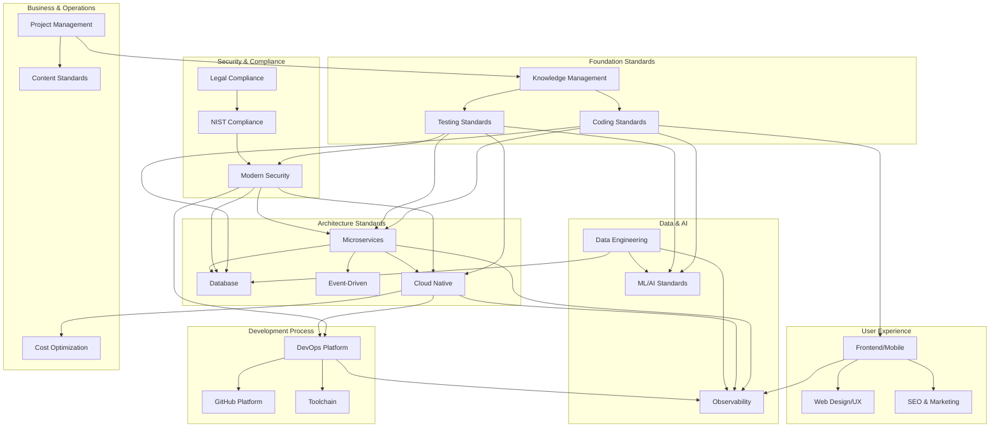
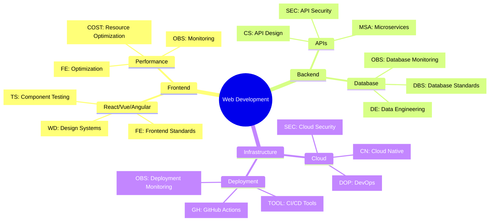
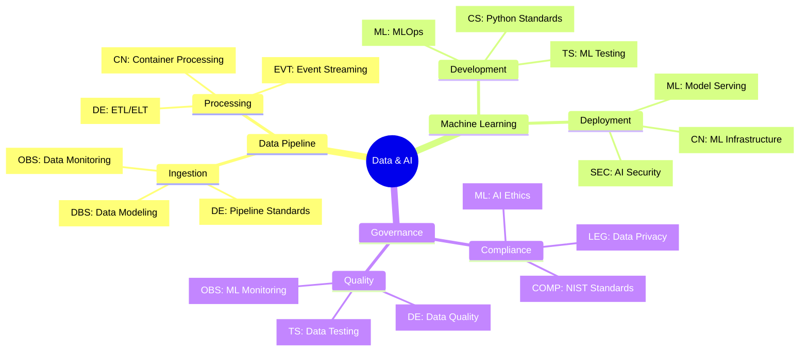
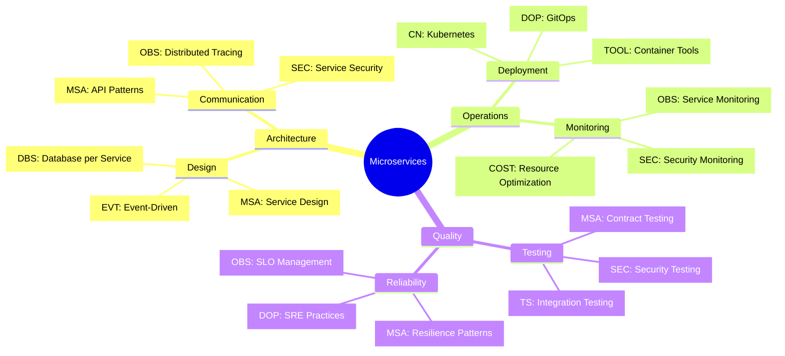
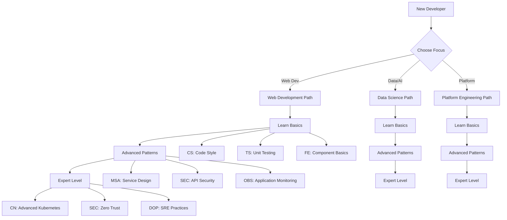
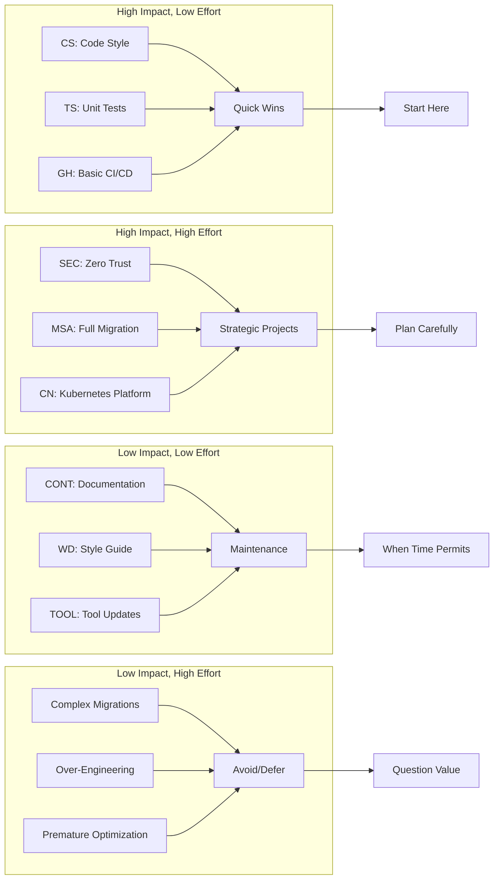

# Interactive Visual Standards Navigation

**Version:** 1.0.0
**Last Updated:** January 2025
**Status:** Active

---

## Standards Relationship Map



## Interactive Standards Navigator

### Quick Access by Technology Stack

#### Full-Stack Web Development



#### Data & AI Projects



#### Microservices Platform



## Visual Learning Paths

### Beginner to Expert Journey



## Implementation Priority Matrix



## Context-Aware Documentation

### Smart Loading Examples

Use these patterns to load relevant documentation based on your current task:

#### For API Development

```markdown
Context: Building REST API
Auto-loads: CS:api + SEC:api + TS:integration + OBS:api-monitoring
```

#### For Database Work

```markdown
Context: Database migration
Auto-loads: DBS:migration + TS:database + SEC:data-protection + OBS:database-monitoring
```

#### For Security Implementation

```markdown
Context: Security feature
Auto-loads: SEC:relevant-section + CS:security + TS:security + COMP:nist-controls
```

#### For Performance Optimization

```markdown
Context: Performance issues
Auto-loads: OBS:performance + FE:optimization + DBS:query-optimization + COST:resource-optimization
```

## Interactive Elements Guide

### Expandable Sections

Click on any standard code to see:

- Quick summary (100 words)
- Key implementation points
- Related standards
- Common patterns
- Troubleshooting tips

### Progressive Disclosure

- **Level 1**: Overview and principles
- **Level 2**: Implementation patterns
- **Level 3**: Detailed examples
- **Level 4**: Advanced configurations

### Cross-Reference Navigation

- Hover over standard codes for quick previews
- Click to jump to full documentation
- See related standards automatically
- Access implementation examples

---

*This navigation system is designed to make the standards more discoverable and reduce cognitive load when working with complex, interconnected documentation.*
