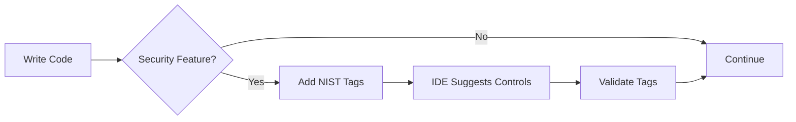

---
nist_800_53_r5:
  controls:
    - control_id: cm-2
      control_name: Baseline Configuration
      mapping_type: primary
      relevance_score: 1.0
      implementation_coverage: 1.0
      evidence_provided: ["documentation", "process"]
      last_analyzed: 2025-01-15T12:00:00Z
      semantic_keywords: ["compliance", "standards", "nist", "controls", "tagging"]
  auto_generated: false
  generated_date: 2025-01-15T12:00:00Z
  analysis_confidence: 1.0
---

# Compliance Standards

**Version:** 1.0.0
**Last Updated:** 2025-01-18
**Status:** Active
**Standard Code:** COMPLIANCE

---

## Overview

This standard provides comprehensive guidelines for implementing NIST 800-53r5 compliance through code annotations and automated tracking throughout the development lifecycle.

## Purpose

This document establishes standards for integrating NIST 800-53r5 security controls into our development workflow through automated tagging, continuous compliance monitoring, and evidence collection.

## Table of Contents

1. [NIST Control Tagging](#nist-control-tagging)
2. [Annotation Formats](#annotation-formats)
3. [Evidence Collection](#evidence-collection)
4. [Compliance Workflow](#compliance-workflow)
5. [LLM Integration](#llm-integration)
6. [Common Control Mappings](#common-control-mappings)
7. [Validation Rules](#validation-rules)
8. [Best Practices](#best-practices)

---

## NIST Control Tagging

### When to Tag

Tag code, configuration, and documentation when implementing:

1. **Security Functions**
   - Authentication mechanisms → `ia-2`, `ia-5`
   - Authorization logic → `ac-2`, `ac-3`, `ac-6`
   - Session management → `ac-12`
   - Password policies → `ia-5.1`

2. **Data Protection**
   - Encryption at rest → `sc-28`
   - Encryption in transit → `sc-8`, `sc-13`
   - Data sanitization → `mp-6`
   - Secure storage → `sc-28.1`

3. **Audit & Logging**
   - Security event logging → `au-2`, `au-3`
   - Log retention → `au-11`
   - Log protection → `au-9`
   - Audit trails → `au-12`

4. **Error Handling**
   - Error messages → `si-11`
   - Exception handling → `si-11.a`
   - Information leakage prevention → `sc-30`

5. **Configuration Security**
   - Secure defaults → `cm-6`, `cm-7`
   - Hardening → `cm-6.1`
   - Least functionality → `cm-7`

### Tagging Hierarchy

```
Organization Level
└── Repository Level (@nist-baseline: moderate)
    └── File Level (@nist-context: authentication)
        └── Function Level (@nist ac-2 "User management")
            └── Line Level (// @nist-implements ac-2.a)
```

---

## Annotation Formats

### Code Annotations

#### TypeScript/JavaScript
```typescript
/**
 * @nist ac-2 Account Management
 * @nist ac-2.1 Automated System Account Management
 * @satisfies AC-2(a): Account type identification
 * @satisfies AC-2(d): Role specification
 * @evidence code, test, doc
 * @confidence 0.95
 */
export class AccountManager {
  /**
   * @nist-implements ac-2.a "Account type selection"
   * @nist-implements ac-2.j "Account review"
   */
  async createAccount(userData: UserData): Promise<Account> {
    // @nist ac-2.a.1 "Identify account type"
    const accountType = this.identifyAccountType(userData);

    // @nist ia-5.1 "Password complexity validation"
    await this.validatePassword(userData.password);

    // @nist au-2 "Audit account creation"
    await this.audit.log('account.created', { userId: userData.id });

    return account;
  }
}
```

#### Python
```python
class AuthenticationService:
    """
    @nist ia-2 Identification and Authentication
    @nist ia-2.1 MFA for Privileged Accounts
    @evidence code, config
    """

    def authenticate(self, credentials: Credentials) -> AuthResult:
        """
        @nist-implements ia-2 "User authentication"
        @nist-implements ia-8 "System user identification"
        """
        # @nist ia-5 "Authenticator management"
        if not self.validate_credentials(credentials):
            # @nist au-2 "Failed authentication audit"
            self.audit_log.record_failure(credentials.username)
            raise AuthenticationError()
```

#### Go
```go
// AccountService manages user accounts
// @nist ac-2 Account Management
// @nist ac-3 Access Enforcement
type AccountService struct {
    // Implementation
}

// CreateUser creates a new user account
// @nist-implements ac-2.a "Account creation"
// @nist-implements ia-5.1 "Initial authenticator"
func (s *AccountService) CreateUser(data UserData) (*User, error) {
    // @nist ac-2.d "Specify authorized users"
    if err := s.validateUserData(data); err != nil {
        return nil, err
    }
}
```

### Configuration Annotations

#### YAML
```yaml
# security-config.yaml
# @nist-baseline: moderate
# @nist-controls:
#   - sc-8: Transmission Confidentiality
#   - sc-13: Cryptographic Protection
#   - sc-23: Session Authenticity
#   - ac-12: Session Termination

security:
  tls:
    # @nist sc-8 "TLS configuration"
    # @nist sc-13.a "FIPS-validated cryptography"
    version: "1.3"
    cipher_suites:
      - TLS_AES_256_GCM_SHA384       # @nist sc-13 "NIST-approved"
      - TLS_CHACHA20_POLY1305_SHA256  # @nist sc-13 "NIST-approved"

  session:
    # @nist ac-12 "Session termination"
    timeout_minutes: 30  # @nist ac-12.1.a "Inactivity timeout"
    max_duration_hours: 12  # @nist ac-12.1.b "Maximum session length"
```

#### JSON
```json
{
  "_nist_controls": ["au-2", "au-3", "au-11"],
  "_nist_baseline": "moderate",

  "logging": {
    "_nist": "au-2",
    "level": "info",
    "audit_events": {
      "_nist": "au-2.d",
      "authentication": true,
      "authorization": true,
      "data_access": true,
      "configuration_changes": true
    },
    "retention": {
      "_nist": "au-11",
      "days": 90,
      "archive": true
    }
  }
}
```

### Documentation Annotations

#### Markdown with Frontmatter
```markdown
---
nist_controls:
  - control_id: ac-1
    title: Access Control Policy and Procedures
    implementation: documented
    evidence_type: policy
    sections: ["2", "3.1", "4"]
  - control_id: pl-2
    title: System Security Plan
    implementation: documented
    evidence_type: plan
---

# Security Architecture <!-- @nist ac-1, pl-2 -->

## Access Control Policy <!-- @nist ac-1 -->

This section defines... <!-- @nist-implements ac-1.a.1 -->
```

#### Inline Documentation Tags
```markdown
## Authentication Design <!-- @nist ia-2, ia-5 -->

The system implements multi-factor authentication <!-- @nist ia-2.1 --> using:

1. Something you know (password) <!-- @nist ia-5.1 -->
2. Something you have (TOTP) <!-- @nist ia-2.1 -->
3. Something you are (biometric) <!-- @nist ia-2.2 -->
```

---

## Evidence Collection

### Automatic Evidence Types

1. **Code Evidence**
   - Function/class with @nist tags
   - Implementation patterns
   - Security controls in code

2. **Test Evidence**
   - Tests for tagged functions
   - Security test suites
   - Compliance test results

3. **Configuration Evidence**
   - Security settings
   - Hardening configurations
   - Policy definitions

4. **Documentation Evidence**
   - Architecture documents
   - Security procedures
   - API documentation

### Evidence Metadata

```typescript
interface Evidence {
  control_id: string;
  evidence_type: 'code' | 'test' | 'config' | 'doc';
  location: string;
  description: string;
  confidence: number; // 0.0-1.0
  last_validated: Date;
  validation_method: 'automated' | 'manual' | 'hybrid';
  artifacts: Array<{
    type: string;
    path: string;
    hash: string;
  }>;
}
```

---

## Compliance Workflow

### Development Phase



### CI/CD Pipeline

```yaml
# .github/workflows/compliance.yml
name: Continuous Compliance

on: [push, pull_request]

jobs:
  compliance-check:
    steps:
      - name: Validate NIST Tags
        run: nist-validator check

      - name: Coverage Report
        run: nist-validator coverage --min 80

      - name: Evidence Collection
        run: nist-validator collect-evidence

      - name: Update SSP
        if: github.ref == 'refs/heads/main'
        run: nist-validator generate-ssp
```

### Pre-Commit Hooks

```bash
#!/bin/bash
# .git/hooks/pre-commit

# Check for untagged security code
security_files=$(git diff --cached --name-only | grep -E '\.(ts|js|py|go)$')

for file in $security_files; do
  if grep -E '(auth|encrypt|password|session|audit|log)' "$file" > /dev/null; then
    if ! grep -E '@nist\s+[a-z]{2}-[0-9]' "$file" > /dev/null; then
      echo "⚠️  Security code in $file may need NIST tags"
      echo "Suggested controls based on content:"
      nist-suggest "$file"
    fi
  fi
done
```

---

## LLM Integration

### Context for LLMs

When working with code that needs NIST tags, provide this context:

```markdown
You are helping tag code with NIST 800-53r5 controls.

Project context:
- Security baseline: moderate
- System type: web application
- Data classification: CUI

When you see security-related code, suggest appropriate NIST controls:
- Authentication → ia-2, ia-5
- Authorization → ac-2, ac-3
- Encryption → sc-8, sc-13
- Logging → au-2, au-3

Format: @nist <control-id> "<brief description>"
```

### LLM Prompts for Control Suggestions

```typescript
const CONTROL_SUGGESTION_PROMPT = `
Analyze this code and suggest NIST 800-53r5 controls:

\`\`\`${language}
${code}
\`\`\`

Consider:
1. Security functionality implemented
2. Data protection measures
3. Access control mechanisms
4. Audit capabilities

Return JSON:
{
  "controls": [
    {
      "id": "control-id",
      "rationale": "why this applies",
      "confidence": 0.0-1.0,
      "implementation_points": ["specific lines or functions"]
    }
  ]
}
`;
```

---

## Common Control Mappings

### Authentication & Identity

| Implementation | NIST Controls | Example |
|----------------|---------------|---------|
| User login | `ia-2`, `ia-8` | `@nist ia-2 "User authentication"` |
| Password validation | `ia-5.1` | `@nist ia-5.1 "Password complexity"` |
| MFA/2FA | `ia-2.1`, `ia-2.2` | `@nist ia-2.1 "Multi-factor auth"` |
| Session management | `ac-12` | `@nist ac-12 "Session termination"` |
| Account lockout | `ac-7` | `@nist ac-7 "Unsuccessful attempts"` |

### Access Control

| Implementation | NIST Controls | Example |
|----------------|---------------|---------|
| RBAC | `ac-2`, `ac-3` | `@nist ac-3 "Role-based access"` |
| User provisioning | `ac-2.a` | `@nist ac-2.a "Account management"` |
| Least privilege | `ac-6` | `@nist ac-6 "Least privilege"` |
| Separation of duties | `ac-5` | `@nist ac-5 "Duty separation"` |

### Data Protection

| Implementation | NIST Controls | Example |
|----------------|---------------|---------|
| TLS/HTTPS | `sc-8`, `sc-23` | `@nist sc-8 "Transmission protection"` |
| Encryption at rest | `sc-28` | `@nist sc-28 "Data at rest encryption"` |
| Cryptographic functions | `sc-13` | `@nist sc-13 "Crypto protection"` |
| Key management | `sc-12` | `@nist sc-12 "Key establishment"` |

### Audit & Logging

| Implementation | NIST Controls | Example |
|----------------|---------------|---------|
| Security event logging | `au-2` | `@nist au-2 "Audit events"` |
| Log content | `au-3` | `@nist au-3 "Audit record content"` |
| Log retention | `au-11` | `@nist au-11 "Retention policy"` |
| Log protection | `au-9` | `@nist au-9 "Audit information protection"` |

---

## Validation Rules

### Required Elements

1. **Control ID Format**: `[a-z]{2}-[0-9]+(\.[0-9]+)?`
   - Valid: `ac-2`, `ia-5.1`
   - Invalid: `AC2`, `ac_2`, `2`

2. **Required Attributes**:
   - Control ID
   - Brief description (for inline tags)
   - Evidence type (for class/function level)

3. **Consistency Rules**:
   - Child controls must have parent tagged
   - Related controls should be tagged together
   - Evidence must exist for claimed implementations

### Validation Commands

```bash
# Validate all tags in repository
nist-validator validate --all

# Check specific file
nist-validator check src/auth/login.ts

# Suggest missing tags
nist-validator suggest --security-only

# Generate compliance report
nist-validator report --format html
```

---

## Best Practices

### DO ✅

1. **Tag at the Right Level**
   - Class/module level for general controls
   - Function level for specific implementations
   - Line level for critical security operations

2. **Be Specific**
   - Use control enhancements (e.g., `ac-2.1`) when applicable
   - Include satisfies statements for clarity
   - Document confidence levels

3. **Keep Tags Updated**
   - Update tags when refactoring
   - Remove tags when deleting features
   - Review tags during code reviews

4. **Use Automation**
   - Let IDE suggest controls
   - Use pre-commit hooks
   - Enable CI/CD validation

### DON'T ❌

1. **Over-Tag**
   - Don't tag every line
   - Avoid redundant tags
   - Skip obvious utility functions

2. **Mis-Tag**
   - Don't guess control numbers
   - Avoid tagging unrelated code
   - Don't use wrong evidence types

3. **Under-Document**
   - Always include descriptions
   - Document non-obvious mappings
   - Explain implementation choices

### Code Review Checklist

- [ ] Security features have NIST tags
- [ ] Control IDs are valid
- [ ] Evidence types are specified
- [ ] Implementations match control requirements
- [ ] Related controls are tagged together
- [ ] Confidence levels are realistic
- [ ] Documentation is updated

---

## Quick Reference Card

```
Common Tags:
@nist ia-2      → Authentication
@nist ac-3      → Authorization
@nist sc-13     → Encryption
@nist au-2      → Audit logging
@nist ac-12     → Session timeout
@nist ia-5.1    → Password policy
@nist si-11     → Error handling
@nist cm-6      → Configuration

Format:
@nist <id> "<description>"
@nist-implements <id> "<what>"
@satisfies <ID>: <requirement>
@evidence <type>, <type>
@confidence <0.0-1.0>
```

---

## Implementation

### Getting Started

1. Review this standard and identify applicable controls for your project
2. Install the NIST compliance tools: `./scripts/setup-nist-hooks.sh`
3. Start tagging security-related code with `@nist` annotations
4. Use the VS Code extension for real-time suggestions
5. Run validation with `./scripts/nist-pre-commit.sh`

### Implementation Checklist

- [ ] Install git hooks for NIST validation
- [ ] Review and tag authentication code
- [ ] Review and tag authorization code
- [ ] Review and tag encryption implementations
- [ ] Review and tag logging/auditing code
- [ ] Configure CI/CD for continuous compliance
- [ ] Generate initial SSP documentation
- [ ] Set up evidence collection
- [ ] Train team on tagging standards

---

## Related Standards

- [MODERN_SECURITY_STANDARDS.md](MODERN_SECURITY_STANDARDS.md) - Security implementation standards
- [CODING_STANDARDS.md](CODING_STANDARDS.md) - General coding standards
- [TESTING_STANDARDS.md](TESTING_STANDARDS.md) - Security testing requirements
- [CLAUDE.md](./docs/core/CLAUDE.md) - LLM context for compliance
- [UNIFIED_STANDARDS.md](UNIFIED_STANDARDS.md) - Comprehensive standards overview
- [NIST_IMPLEMENTATION_GUIDE.md](./docs/nist/NIST_IMPLEMENTATION_GUIDE.md) - Quick start guide for NIST compliance
