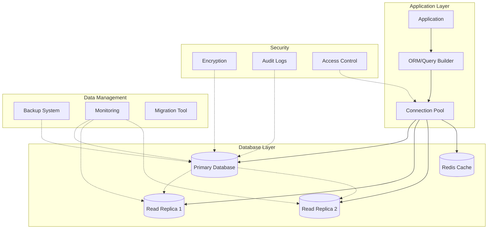
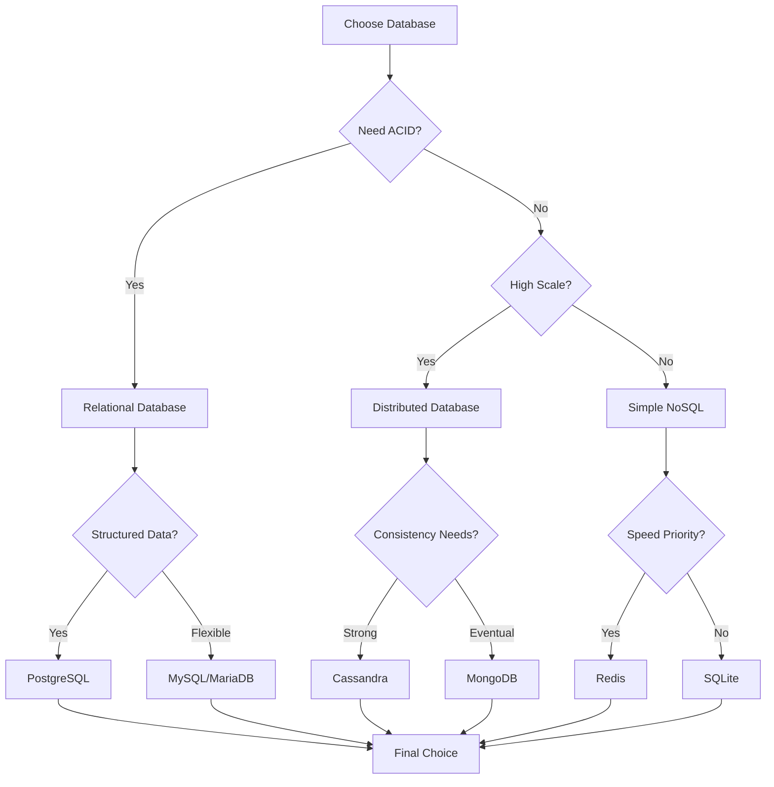
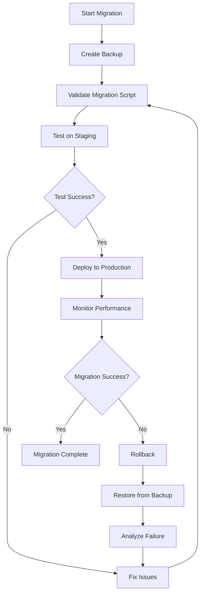
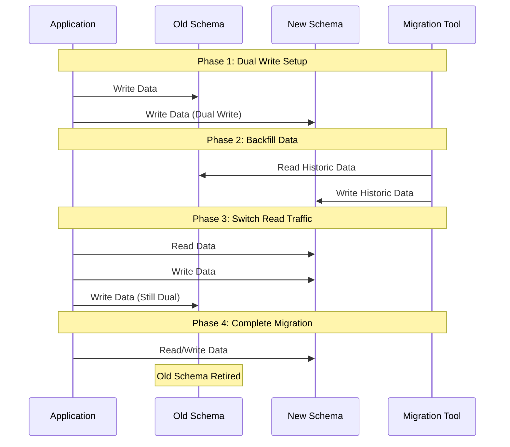

# Database Standards

**Version:** 1.0.0
**Last Updated:** 2025-01-20
**Status:** Active
**Standard Code:** DBS

---

## Table of Contents

1. [Overview](#overview)
2. [SQL Design Patterns](#sql-design-patterns)
3. [NoSQL Patterns](#nosql-patterns)
4. [Data Modeling](#data-modeling)
5. [Query Optimization](#query-optimization)
6. [Migration Strategies](#migration-strategies)
7. [Security Standards](#security-standards)
8. [Backup and Recovery](#backup-and-recovery)
9. [Monitoring and Performance](#monitoring-and-performance)
10. [Implementation Checklist](#implementation-checklist)

## Overview

This standard provides comprehensive guidelines for database design, implementation, and management across SQL and NoSQL systems. It ensures data integrity, performance, security, and maintainability.

### Database Architecture Overview



### Database Selection Decision Tree



### Core Principles

- **ACID Compliance**: Ensure atomicity, consistency, isolation, durability
- **CAP Theorem**: Balance consistency, availability, and partition tolerance
- **Normalization**: Reduce redundancy while maintaining performance
- **Scalability**: Design for horizontal and vertical scaling
- **Security**: Implement defense-in-depth strategies

## SQL Design Patterns

### 1. Table Design Standards

```sql
-- Primary key convention
CREATE TABLE users (
    id BIGSERIAL PRIMARY KEY,
    uuid UUID DEFAULT gen_random_uuid() UNIQUE NOT NULL,
    email VARCHAR(255) UNIQUE NOT NULL,
    created_at TIMESTAMP WITH TIME ZONE DEFAULT CURRENT_TIMESTAMP,
    updated_at TIMESTAMP WITH TIME ZONE DEFAULT CURRENT_TIMESTAMP
);

-- Foreign key with cascade options
CREATE TABLE user_profiles (
    id BIGSERIAL PRIMARY KEY,
    user_id BIGINT NOT NULL,
    bio TEXT,
    CONSTRAINT fk_user
        FOREIGN KEY(user_id)
        REFERENCES users(id)
        ON DELETE CASCADE
);
```

### 2. Indexing Strategies

```sql
-- Composite index for common queries
CREATE INDEX idx_users_email_status ON users(email, status);

-- Partial index for filtered queries
CREATE INDEX idx_active_users ON users(email)
WHERE status = 'active';

-- Full-text search index
CREATE INDEX idx_products_search ON products
USING GIN(to_tsvector('english', name || ' ' || description));
```

### 3. Common Table Expressions (CTEs)

```sql
-- Hierarchical data query
WITH RECURSIVE category_tree AS (
    SELECT id, name, parent_id, 0 as level
    FROM categories
    WHERE parent_id IS NULL

    UNION ALL

    SELECT c.id, c.name, c.parent_id, ct.level + 1
    FROM categories c
    JOIN category_tree ct ON c.parent_id = ct.id
)
SELECT * FROM category_tree ORDER BY level, name;
```

### 4. Stored Procedures and Functions

```sql
-- Idempotent upsert function
CREATE OR REPLACE FUNCTION upsert_user(
    p_email VARCHAR,
    p_name VARCHAR
) RETURNS SETOF users AS $$
BEGIN
    RETURN QUERY
    INSERT INTO users (email, name)
    VALUES (p_email, p_name)
    ON CONFLICT (email)
    DO UPDATE SET
        name = EXCLUDED.name,
        updated_at = CURRENT_TIMESTAMP
    RETURNING *;
END;
$$ LANGUAGE plpgsql;
```

## NoSQL Patterns

### 1. Document Store Design (MongoDB)

```javascript
// User document with embedded data
{
  "_id": ObjectId("..."),
  "email": "user@example.com",
  "profile": {
    "name": "John Doe",
    "preferences": {
      "notifications": true,
      "theme": "dark"
    }
  },
  "addresses": [
    {
      "type": "home",
      "street": "123 Main St",
      "city": "Anytown",
      "primary": true
    }
  ],
  "createdAt": ISODate("2025-01-20T10:00:00Z"),
  "updatedAt": ISODate("2025-01-20T10:00:00Z")
}

// Reference pattern for large datasets
{
  "_id": ObjectId("..."),
  "orderId": "ORD-12345",
  "userId": ObjectId("..."), // Reference to user collection
  "items": [
    {
      "productId": ObjectId("..."), // Reference to products
      "quantity": 2,
      "price": 29.99
    }
  ]
}
```

### 2. Key-Value Store (Redis)

```bash
# Session management
SET session:user:12345 '{"userId": 12345, "role": "admin"}' EX 3600

# Caching with TTL
SET cache:product:ABC123 '{"name": "Widget", "price": 19.99}' EX 300

# Rate limiting
INCR api:rate:user:12345
EXPIRE api:rate:user:12345 60
```

### 3. Wide Column Store (Cassandra)

```cql
-- Time-series data model
CREATE TABLE sensor_data (
    device_id UUID,
    timestamp TIMESTAMP,
    temperature DECIMAL,
    humidity DECIMAL,
    PRIMARY KEY (device_id, timestamp)
) WITH CLUSTERING ORDER BY (timestamp DESC);

-- Materialized view for queries
CREATE MATERIALIZED VIEW sensor_by_date AS
    SELECT * FROM sensor_data
    WHERE device_id IS NOT NULL
    AND timestamp IS NOT NULL
    AND date = toDate(timestamp)
    PRIMARY KEY (date, timestamp, device_id);
```

## Data Modeling

### 1. Normalization Levels

```sql
-- 3NF: Eliminate transitive dependencies
CREATE TABLE products (
    id BIGSERIAL PRIMARY KEY,
    name VARCHAR(255) NOT NULL,
    category_id INT REFERENCES categories(id)
);

CREATE TABLE categories (
    id SERIAL PRIMARY KEY,
    name VARCHAR(100) NOT NULL,
    department_id INT REFERENCES departments(id)
);

-- Denormalization for performance
CREATE TABLE order_summary (
    order_id BIGINT PRIMARY KEY,
    user_email VARCHAR(255), -- Denormalized
    total_amount DECIMAL(10,2),
    product_count INT,
    created_at TIMESTAMP
);
```

### 2. Audit Trail Pattern

```sql
-- Audit table
CREATE TABLE audit_log (
    id BIGSERIAL PRIMARY KEY,
    table_name VARCHAR(50) NOT NULL,
    record_id BIGINT NOT NULL,
    action VARCHAR(10) NOT NULL,
    old_data JSONB,
    new_data JSONB,
    user_id BIGINT,
    timestamp TIMESTAMP DEFAULT CURRENT_TIMESTAMP
);

-- Trigger for automatic auditing
CREATE TRIGGER audit_users_changes
AFTER INSERT OR UPDATE OR DELETE ON users
FOR EACH ROW EXECUTE FUNCTION audit_trigger();
```

## Query Optimization

### 1. Query Analysis

```sql
-- Explain analyze for performance
EXPLAIN (ANALYZE, BUFFERS)
SELECT u.*, COUNT(o.id) as order_count
FROM users u
LEFT JOIN orders o ON u.id = o.user_id
WHERE u.created_at > '2025-01-01'
GROUP BY u.id;

-- Query hints
SELECT /*+ INDEX(users idx_created_at) */ *
FROM users
WHERE created_at > '2025-01-01';
```

### 2. Optimization Techniques

```sql
-- Avoid N+1 queries
-- Bad: Multiple queries
SELECT * FROM users;
-- Then for each user: SELECT * FROM orders WHERE user_id = ?

-- Good: Single query with join
SELECT u.*, o.*
FROM users u
LEFT JOIN orders o ON u.id = o.user_id;

-- Pagination optimization
SELECT * FROM products
WHERE id > ? -- Last seen ID
ORDER BY id
LIMIT 100;
```

## Migration Strategies

### Database Migration Flow



### Zero-Downtime Migration Strategy



### 1. Schema Migrations

```sql
-- Versioned migrations
CREATE TABLE schema_migrations (
    version VARCHAR(255) PRIMARY KEY,
    applied_at TIMESTAMP DEFAULT CURRENT_TIMESTAMP
);

-- Safe column addition
ALTER TABLE users ADD COLUMN IF NOT EXISTS
    phone VARCHAR(20);

-- Zero-downtime migration
-- Step 1: Add nullable column
ALTER TABLE users ADD COLUMN email_verified BOOLEAN;
-- Step 2: Backfill data
UPDATE users SET email_verified = false WHERE email_verified IS NULL;
-- Step 3: Add constraint
ALTER TABLE users ALTER COLUMN email_verified SET NOT NULL;
```

### 2. Data Migration Patterns

```sql
-- Batch processing for large datasets
DO $$
DECLARE
    batch_size INT := 1000;
    offset_val INT := 0;
BEGIN
    LOOP
        UPDATE users
        SET processed = true
        WHERE id IN (
            SELECT id FROM users
            WHERE processed = false
            LIMIT batch_size
        );

        EXIT WHEN NOT FOUND;
        COMMIT;
    END LOOP;
END $$;
```

## Security Standards

### 1. Access Control

```sql
-- Role-based access
CREATE ROLE app_read;
GRANT SELECT ON ALL TABLES IN SCHEMA public TO app_read;

CREATE ROLE app_write;
GRANT SELECT, INSERT, UPDATE, DELETE ON ALL TABLES IN SCHEMA public TO app_write;

-- Row-level security
ALTER TABLE documents ENABLE ROW LEVEL SECURITY;

CREATE POLICY user_documents ON documents
    FOR ALL
    TO app_user
    USING (user_id = current_user_id());
```

### 2. Data Encryption

```sql
-- Column-level encryption
CREATE EXTENSION IF NOT EXISTS pgcrypto;

-- Encrypt sensitive data
INSERT INTO users (email, ssn_encrypted)
VALUES (
    'user@example.com',
    pgp_sym_encrypt('123-45-6789', 'encryption_key')
);

-- Decrypt when needed
SELECT
    email,
    pgp_sym_decrypt(ssn_encrypted, 'encryption_key') as ssn
FROM users;
```

## Backup and Recovery

### 1. Backup Strategies

```bash
# Continuous archiving (PostgreSQL)
archive_mode = on
archive_command = 'cp %p /backup/archive/%f'

# Point-in-time recovery
pg_basebackup -D /backup/base -Ft -z -P

# Incremental backups (MongoDB)
mongodump --oplog --out /backup/$(date +%Y%m%d)
```

### 2. Recovery Procedures

```sql
-- Transaction log recovery
RESTORE DATABASE mydb FROM '/backup/full.bak'
WITH NORECOVERY;

RESTORE LOG mydb FROM '/backup/log1.trn'
WITH NORECOVERY;

RESTORE DATABASE mydb WITH RECOVERY;
```

## Monitoring and Performance

### 1. Key Metrics

```sql
-- Connection monitoring
SELECT
    datname,
    count(*) as connections,
    count(*) FILTER (WHERE state = 'active') as active
FROM pg_stat_activity
GROUP BY datname;

-- Slow query log
SELECT
    query,
    calls,
    mean_exec_time,
    total_exec_time
FROM pg_stat_statements
WHERE mean_exec_time > 1000 -- ms
ORDER BY mean_exec_time DESC;
```

### 2. Performance Tuning

```sql
-- Cache hit ratio
SELECT
    sum(heap_blks_hit) / nullif(sum(heap_blks_hit) + sum(heap_blks_read), 0) as cache_hit_ratio
FROM pg_statio_user_tables;

-- Index usage
SELECT
    schemaname,
    tablename,
    indexname,
    idx_scan,
    idx_tup_read,
    idx_tup_fetch
FROM pg_stat_user_indexes
ORDER BY idx_scan;
```

## Implementation Checklist

### Database Design

- [ ] Define clear naming conventions
- [ ] Document all schemas and relationships
- [ ] Implement proper normalization (3NF minimum)
- [ ] Plan for scalability from the start
- [ ] Create comprehensive indexes

### Security

- [ ] Implement least privilege access
- [ ] Enable encryption at rest and in transit
- [ ] Set up audit logging
- [ ] Regular security assessments
- [ ] Implement SQL injection prevention

### Performance

- [ ] Establish baseline metrics
- [ ] Set up query monitoring
- [ ] Implement connection pooling
- [ ] Configure appropriate cache sizes
- [ ] Regular performance reviews

### Operations

- [ ] Automated backup procedures
- [ ] Tested recovery processes
- [ ] Monitoring and alerting
- [ ] Capacity planning
- [ ] Documentation maintenance

### Development

- [ ] Version control for schema changes
- [ ] Automated migration testing
- [ ] Code review for database changes
- [ ] Performance testing for queries
- [ ] Integration with CI/CD pipeline

## Related Standards

### Data Engineering Standards

- **DATA_ENGINEERING_STANDARDS.md** - Data pipeline design and data modeling standards
- **Cross-reference**: Use DE:modeling section for data warehouse design patterns
- **Integration**: Database performance tuning aligns with DE:quality standards

### Security Standards

- **MODERN_SECURITY_STANDARDS.md** - Database security and encryption requirements
- **Cross-reference**: Use SEC:encryption section for data-at-rest protection
- **Integration**: Database access control follows SEC:auth patterns

### Observability Standards

- **OBSERVABILITY_STANDARDS.md** - Database monitoring and performance metrics
- **Cross-reference**: Use OBS:metrics section for database monitoring setup
- **Integration**: Database performance aligns with OBS:slos standards

### Cloud Native Standards

- **CLOUD_NATIVE_STANDARDS.md** - Container-based database deployment
- **Cross-reference**: Use CN:kubernetes section for database operator patterns
- **Integration**: Database scaling follows CN:optimization principles

### Testing Standards

- **TESTING_STANDARDS.md** - Database testing and migration validation
- **Cross-reference**: Use TS:integration section for database test patterns
- **Integration**: Database migration testing follows TS:coverage standards

---

*This standard is maintained by the Database Architecture team and reviewed quarterly.*
