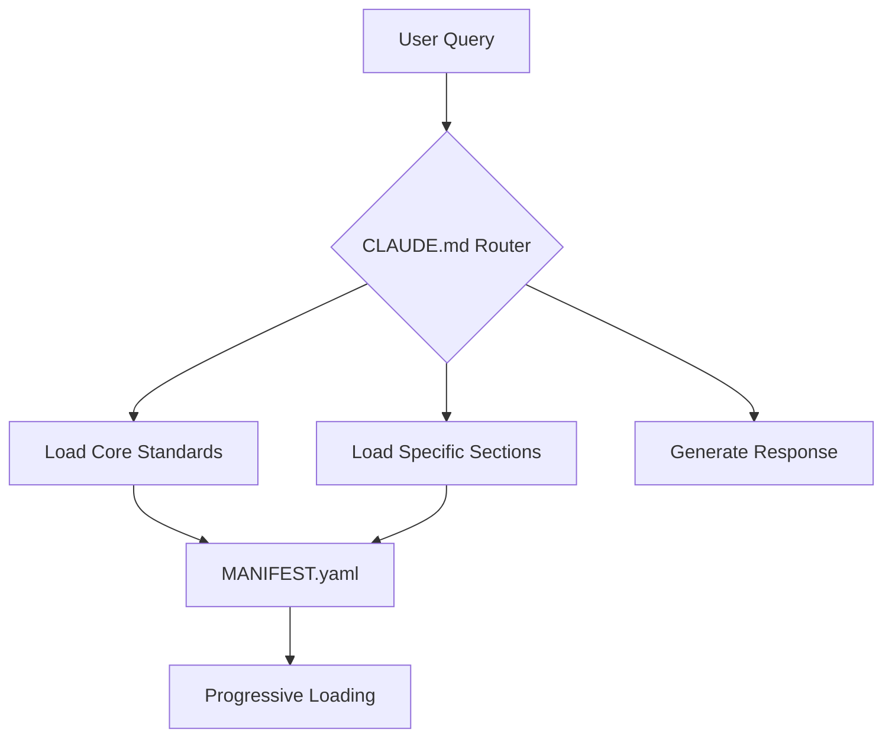

# Knowledge Management Standards

**Version:** 1.0.0
**Last Updated:** January 2025
**Status:** Active
**Standard Code:** KM

---

## 📋 Table of Contents

1. [Overview](#overview)
2. [Core Principles](#core-principles)
3. [Knowledge Architecture](#knowledge-architecture)
4. [Documentation Standards](#documentation-standards)
5. [AI/LLM Integration](#aillm-integration)
6. [Progressive Disclosure System](#progressive-disclosure-system)
7. [Cross-Reference Architecture](#cross-reference-architecture)
8. [Version Management](#version-management)
9. [Search & Discovery](#search--discovery)
10. [Implementation Checklist](#implementation-checklist)

---

## Overview

This standard defines how to create, organize, and maintain comprehensive
knowledge management systems for software projects. It codifies the approach
used in this standards repository and provides a blueprint for other projects
to implement similar systems.

### When to Use This Standard

- Building comprehensive documentation systems
- Creating AI-optimized knowledge bases
- Establishing multi-project standards
- Implementing progressive disclosure documentation
- Managing complex technical knowledge

### Prerequisites

- Understanding of markdown documentation
- Familiarity with semantic versioning
- Basic knowledge of YAML/JSON formats

### Real-World Implementation

This standard codifies the approach used in this standards repository itself.
Key implementations include:

- **CLAUDE.md** - AI router with 90% token reduction
- **MANIFEST.yaml** - Progressive loading metadata
- **KICKSTART_PROMPT.md** - Natural language project analysis
- **Cross-referenced standards** - 21+ interconnected documents
- **Machine-readable formats** - YAML/JSON for automation

---

## Core Principles

### 1. Progressive Disclosure

Knowledge should be accessible at multiple levels of detail, allowing users to start simple and dive deeper as needed.

**Implementation:**

```yaml
# MANIFEST.yaml example
standard:
  sections:
    overview:
      tokens: 500
      priority: critical
      description: "High-level introduction"
    details:
      tokens: 2000
      priority: high
      description: "Comprehensive implementation"
    advanced:
      tokens: 1500
      priority: medium
      description: "Edge cases and optimizations"
```

### 2. AI-First Design

Documentation should be optimized for both human readers and AI assistants.

**Example Structure:**

```markdown
## Section Name

**Summary:** One-line description for quick reference
**Tokens:** ~500 (helps AI plan context usage)
**Priority:** critical/high/medium/low

### Details
[Full content here]
```

### 3. Modular Architecture

Knowledge should be organized in self-contained, reusable modules.

```text
standards/
├── core/
│   ├── CODING_STANDARDS.md
│   └── TESTING_STANDARDS.md
├── specialized/
│   ├── CLOUD_NATIVE_STANDARDS.md
│   └── DATA_ENGINEERING_STANDARDS.md
└── meta/
    ├── KNOWLEDGE_MANAGEMENT_STANDARDS.md
    └── CREATING_STANDARDS_GUIDE.md
```

### 4. Semantic Relationships

Documents should explicitly define their relationships to other documents.

```yaml
# In document metadata
dependencies:
  requires: ["CODING_STANDARDS", "TESTING_STANDARDS"]
  recommends: ["SECURITY_STANDARDS"]
  conflicts: ["LEGACY_PATTERNS"]
```

### 5. Living Documentation

All documentation should be versioned, dated, and actively maintained.

```markdown
**Version:** 1.2.3
**Last Updated:** January 2025
**Status:** Active/Draft/Deprecated
**Next Review:** March 2025
```

---

## Knowledge Architecture

### [REQUIRED] Repository Structure

```text
project-root/
├── README.md                    # Entry point with quick start
├── CLAUDE.md                   # AI interface and routing
├── MANIFEST.yaml               # Machine-readable metadata
├── standards/                  # Core knowledge base
│   ├── *.md                   # Individual standard documents
│   └── meta/                  # Meta-standards
├── examples/                   # Practical implementations
│   ├── project-templates/     # Ready-to-use templates
│   └── code-examples/         # Annotated examples
├── tools/                     # Supporting tooling
│   ├── validation/           # Quality checks
│   └── generation/           # Auto-generation scripts
└── .github/                  # Automation
    └── workflows/            # CI/CD for standards
```

### [REQUIRED] Document Hierarchy

1. **Entry Documents** (README.md)
   - Quick start guides
   - Navigation aids
   - Purpose statements

2. **Router Documents** (CLAUDE.md)
   - AI optimization layers
   - Dynamic loading patterns
   - Context management

3. **Core Standards** (*.md)
   - Comprehensive guidelines
   - Implementation details
   - Code examples

4. **Meta Documents** (meta/*.md)
   - How to use the system
   - How to contribute
   - Architecture documentation

### [RECOMMENDED] Metadata Layer

```yaml
# standards-metadata.yaml
standards:
  - id: "CS"
    name: "Coding Standards"
    file: "CODING_STANDARDS.md"
    category: "core"
    tokens: 15000
    sections: 12
    last_updated: "2025-01-15"
    dependencies: []
    tags: ["development", "quality", "required"]
```

---

## Documentation Standards

### [REQUIRED] Document Structure

Every knowledge document must follow this structure:

```markdown
# Document Title

**Version:** X.Y.Z
**Last Updated:** YYYY-MM-DD
**Status:** Active/Draft/Deprecated
**Standard Code:** XX (2-4 letters)

## Table of Contents
[Auto-generated or manual]

## Overview
[Purpose, scope, and audience]

## Core Content
[Main knowledge sections]

## Implementation
[Practical examples and patterns]

## References
[Related documents and resources]
```

### [REQUIRED] Section Tagging

Use explicit tags to indicate requirement levels:

```markdown
### [REQUIRED] Critical Feature
Must be implemented for compliance.

### [RECOMMENDED] Best Practice
Should be implemented unless there's a valid reason.

### [OPTIONAL] Enhancement
Can be implemented for additional benefits.
```

### [REQUIRED] Code Examples

Every concept must include practical examples:

```python
# Good: Complete, runnable example
from typing import Optional
import logging

class DocumentManager:
    """Manages document lifecycle with versioning."""

    def __init__(self, storage_backend: StorageBackend):
        self.storage = storage_backend
        self.logger = logging.getLogger(__name__)

    def save_document(
        self,
        doc_id: str,
        content: str,
        metadata: Optional[dict] = None
    ) -> str:
        """Save document with automatic versioning."""
        try:
            version = self.storage.get_next_version(doc_id)
            self.storage.save(doc_id, content, version, metadata)
            self.logger.info(f"Saved {doc_id} v{version}")
            return version
        except StorageError as e:
            self.logger.error(f"Failed to save {doc_id}: {e}")
            raise
```

### [RECOMMENDED] Visual Aids

Include diagrams for complex relationships:



---

## AI/LLM Integration

### [REQUIRED] Token Optimization

Design documents for efficient AI consumption:

1. **Summary Sections**: 100-200 tokens for quick overview
2. **Progressive Detail**: Structured for selective loading
3. **Semantic Chunking**: Logical breaks every 500-1000 tokens
4. **Inline Metadata**: Token counts and priorities

### [REQUIRED] Router Document (CLAUDE.md Pattern)

Every knowledge base needs an AI router:

```markdown
# AI Knowledge Router

## Quick Patterns
@load [topic:section] - Load specific section
@summary [topic] - Get executive summary
@find "natural query" - Semantic search

## Natural Language Mappings
| User Says | System Loads | Context |
|-----------|--------------|---------|
| "How do I test?" | TS:* + CS:testing | Testing practices |
| "Security help" | SEC:* + CS:security | Security standards |
```

### [RECOMMENDED] Context Windows

Structure for different AI context limits:

```yaml
loading_strategies:
  small_context:  # < 4K tokens
    - load: ["overview", "quick_reference"]
    - exclude: ["examples", "appendices"]

  medium_context:  # 4K-32K tokens
    - load: ["overview", "core_sections", "examples"]
    - lazy_load: ["advanced", "edge_cases"]

  large_context:  # > 32K tokens
    - load: ["*"]
    - optimize: ["remove_duplicates", "compress_examples"]
```

### [REQUIRED] Machine-Readable Formats

Provide structured data formats:

```json
{
  "standards": {
    "coding": {
      "file": "CODING_STANDARDS.md",
      "sections": {
        "overview": { "tokens": 500, "priority": "critical" },
        "style": { "tokens": 1500, "priority": "high" },
        "patterns": { "tokens": 2000, "priority": "medium" }
      }
    }
  }
}
```

---

## Progressive Disclosure System

### [REQUIRED] Information Layers

Implement multiple detail levels:

1. **Quick Reference** (< 100 tokens)

   ```markdown
   **Python Naming:** snake_case for functions, PascalCase for classes
   ```

2. **Summary** (100-500 tokens)

   ```markdown
   ### Python Naming Conventions
   - Functions: snake_case (get_user_name)
   - Classes: PascalCase (UserAccount)
   - Constants: UPPER_SNAKE (MAX_RETRIES)
   - Private: Leading underscore (_internal_method)
   ```

3. **Detailed** (500-2000 tokens)
   - Full examples
   - Edge cases
   - Anti-patterns
   - Migration guides

4. **Comprehensive** (2000+ tokens)
   - Academic background
   - Historical context
   - Alternative approaches
   - Research references

### [RECOMMENDED] Dynamic Loading

Implement smart loading based on context:

```typescript
interface LoadingStrategy {
  assess(query: string): DetailLevel;
  load(level: DetailLevel): Documentation;
  expand(currentDocs: Documentation): Documentation;
}

class ProgressiveLoader implements LoadingStrategy {
  assess(query: string): DetailLevel {
    if (query.includes('quick') || query.includes('summary')) {
      return DetailLevel.Summary;
    }
    if (query.includes('example') || query.includes('how to')) {
      return DetailLevel.Detailed;
    }
    return DetailLevel.Comprehensive;
  }
}
```

---

## Cross-Reference Architecture

### [REQUIRED] Explicit Relationships

Define clear relationships between documents:

```yaml
# In STANDARDS_GRAPH.md or metadata
relationships:
  CODING_STANDARDS:
    depends_on: []
    required_by: ["TESTING_STANDARDS", "SECURITY_STANDARDS"]
    related_to: ["STYLE_GUIDE", "REVIEW_CHECKLIST"]
    conflicts_with: ["LEGACY_PATTERNS"]
```

### [REQUIRED] Bidirectional Links

Always create links in both directions:

```markdown
# In CODING_STANDARDS.md
For testing these patterns, see [TESTING_STANDARDS.md](TESTING_STANDARDS.md#unit-testing)

# In TESTING_STANDARDS.md
For code patterns to test, see [CODING_STANDARDS.md](CODING_STANDARDS.md#patterns)
```

### [RECOMMENDED] Dependency Management

Track and validate dependencies:

```python
# dependency_validator.py
class DependencyValidator:
    def validate_dependencies(self, doc: Document) -> List[Issue]:
        issues = []
        for dep in doc.metadata.get('dependencies', {}).get('requires', []):
            if not self.exists(dep):
                issues.append(f"Missing required dependency: {dep}")
            elif self.is_deprecated(dep):
                issues.append(f"Depends on deprecated standard: {dep}")
        return issues
```

---

## Version Management

### [REQUIRED] Semantic Versioning

All documents must use semantic versioning:

- **Major (X.0.0)**: Breaking changes, restructuring
- **Minor (x.Y.0)**: New sections, significant updates
- **Patch (x.y.Z)**: Corrections, clarifications

### [REQUIRED] Change Tracking

Maintain change history:

```markdown
## Changelog

### [1.2.0] - 2025-01-15
#### Added
- New section on async patterns
- Examples for error handling

#### Changed
- Updated testing requirements to 85%
- Clarified naming conventions

#### Deprecated
- Legacy callback patterns (use async/await)
```

### [RECOMMENDED] Migration Guides

For major version changes:

```markdown
## Migrating from v1.x to v2.0

### Breaking Changes
1. **Removed**: Global state patterns
   - **Old**: `global_config = Config()`
   - **New**: Dependency injection required

### Migration Steps
1. Update all global references
2. Implement DI container
3. Run migration validator
```

---

## Search & Discovery

### [REQUIRED] Search Optimization

Structure content for searchability:

1. **Keywords in Headings**: Use descriptive, searchable headers
2. **Tag System**: Add metadata tags for categorization
3. **Synonyms**: Include alternative terms
4. **Examples**: Real-world, searchable scenarios

### [RECOMMENDED] Discovery Features

Implement discovery aids:

```markdown
## Related Topics
- See also: [TESTING_STANDARDS.md] for testing approaches
- Related: [SECURITY_STANDARDS.md] for security patterns
- Next: [DEPLOYMENT_STANDARDS.md] for deployment

## Common Questions
- **Q**: How do I handle errors?
  **A**: See [Error Handling](#error-handling) section

## Quick Links
- [Most Important Section](#critical-section)
- [Common Patterns](#patterns)
- [Troubleshooting](#troubleshooting)
```

### [RECOMMENDED] Smart Suggestions

Provide contextual recommendations:

```yaml
# suggestions.yaml
context_suggestions:
  - trigger: "reading CODING_STANDARDS"
    suggest: ["TESTING_STANDARDS", "CODE_REVIEW_CHECKLIST"]

  - trigger: "searching error handling"
    suggest: ["LOGGING_STANDARDS", "MONITORING_STANDARDS"]
```

---

## Implementation Checklist

### Phase 1: Foundation (Week 1)

- [ ] Create repository structure
- [ ] Set up README.md with clear navigation
- [ ] Create CLAUDE.md or equivalent AI router
- [ ] Implement MANIFEST.yaml for metadata
- [ ] Set up version control patterns

### Phase 2: Core Documentation (Week 2-3)

- [ ] Migrate/create core documentation
- [ ] Add semantic versioning to all docs
- [ ] Implement [REQUIRED]/[RECOMMENDED] tagging
- [ ] Create cross-references between docs
- [ ] Add code examples to all concepts

### Phase 3: AI Optimization (Week 4)

- [ ] Add token counts to sections
- [ ] Implement progressive loading patterns
- [ ] Create natural language mappings
- [ ] Set up machine-readable formats
- [ ] Test with various AI assistants

### Phase 4: Discovery & Search (Week 5)

- [ ] Implement search optimization
- [ ] Create discovery aids
- [ ] Add smart suggestions
- [ ] Build dependency graph
- [ ] Create quick reference guides

### Phase 5: Automation (Week 6+)

- [ ] Set up validation workflows
- [ ] Implement auto-generation scripts
- [ ] Create update notifications
- [ ] Build compliance checking
- [ ] Add metrics tracking

### Validation Checklist

- [ ] All documents follow standard structure
- [ ] Version numbers are consistent
- [ ] Cross-references are bidirectional
- [ ] AI router handles common queries
- [ ] Search returns relevant results
- [ ] Progressive loading works correctly
- [ ] Dependencies are properly tracked

---

## References

- [CREATING_STANDARDS_GUIDE.md](./docs/guides/CREATING_STANDARDS_GUIDE.md) - How to create new standards
- [STANDARD_TEMPLATE.md](./docs/guides/STANDARD_TEMPLATE.md) - Template for new documents
- [CLAUDE.md](./docs/core/CLAUDE.md) - Example AI router implementation
- [MANIFEST.yaml](./config/MANIFEST.yaml) - Metadata structure example

---

## Appendix: Quick Reference

### Essential Files for Knowledge Management

```text
README.md         # Entry point and navigation
CLAUDE.md        # AI optimization layer
MANIFEST.yaml    # Machine-readable metadata
*_STANDARDS.md   # Individual knowledge documents
CHANGELOG.md     # Version history
```

### Key Commands for Validation

```bash
# Validate structure
find . -name "*.md" -exec grep -L "Version:" {} \;

# Check cross-references
grep -r "\[.*\](\./" --include="*.md" | sort | uniq

# Token count estimation
wc -w *.md | awk '{print $1/3 " tokens (est) - " $2}'
```

### AI Loading Patterns

```text
@load KM:*                    # Load all sections
@load KM:architecture         # Load specific section
@summary KM                   # Get overview only
@find "how to organize docs"  # Natural language search
```

---

**Note:** This standard represents best practices for knowledge management in
technical projects. Adapt these patterns to your specific needs while
maintaining the core principles of progressive disclosure, AI optimization,
and semantic relationships.

## Related Standards

- [CONTRIBUTING.md](../core/CONTRIBUTING.md) - Contributing guidelines
- [Model Context Protocol Standards](MODEL_CONTEXT_PROTOCOL_STANDARDS.md) - Progressive loading patterns for MCP
- [Content Standards](CONTENT_STANDARDS.md) - Content structuring guidelines
