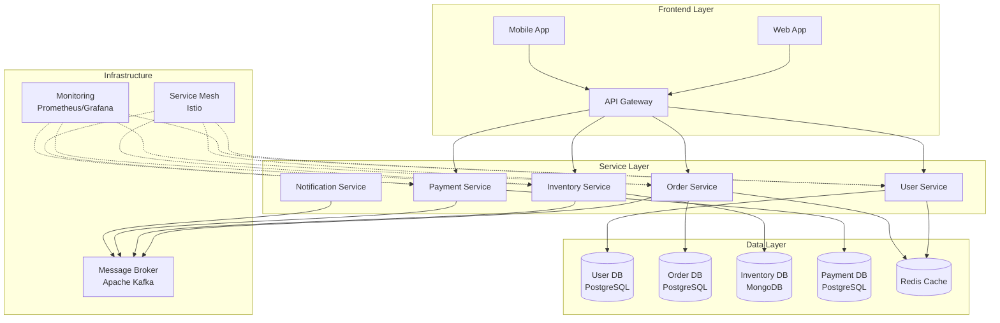
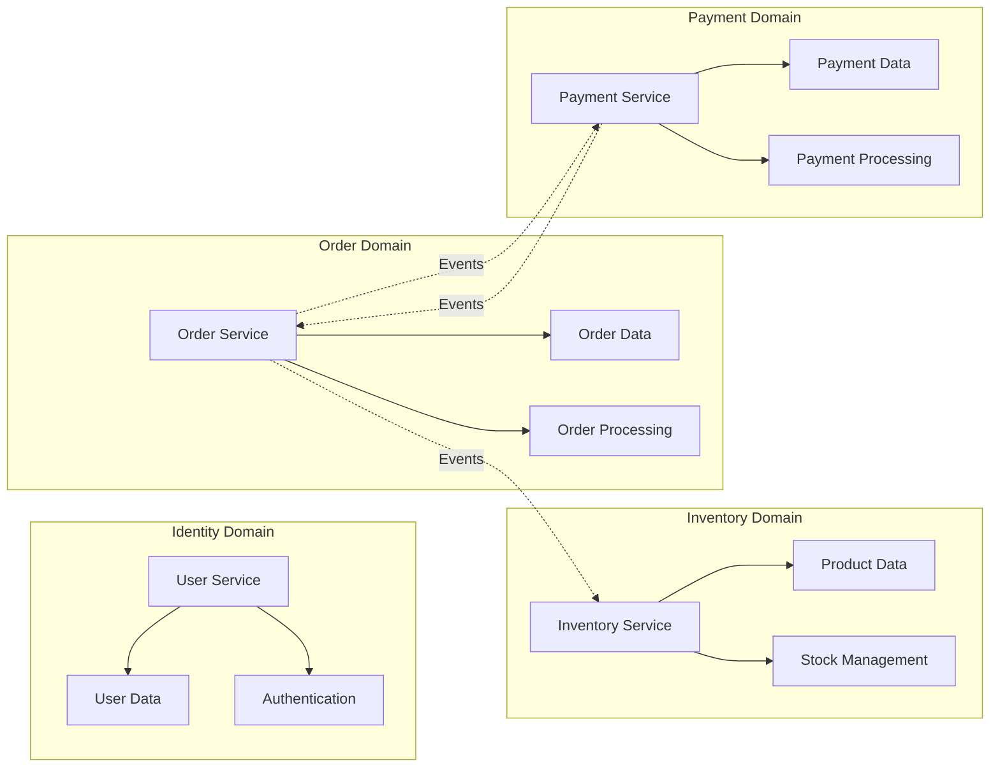
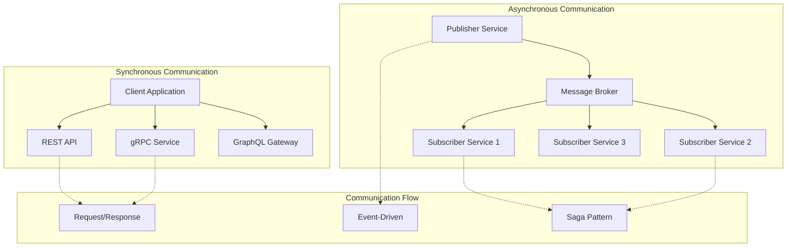
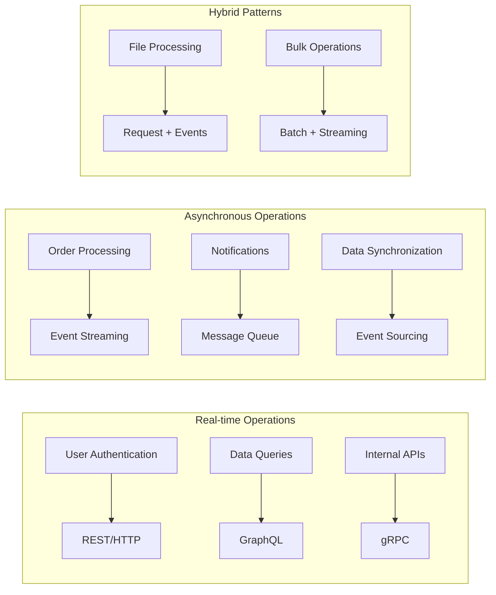

# Microservices Architecture Standards

> 📚 See also: [Unified Software Development Standards](./UNIFIED_STANDARDS.md)


**Version:** 1.0.0
**Last Updated:** January 2025
**Status:** Active
**Standard Code:** MSA

---

**Version:** 1.0.0
**Last Updated:** January 2025
**Status:** Active

## Table of Contents

1. [Service Design and Boundaries](#1-service-design-and-boundaries)
2. [Communication Patterns](#2-communication-patterns)
3. [Service Discovery and Registration](#3-service-discovery-and-registration)
4. [Resilience and Circuit Breakers](#4-resilience-and-circuit-breakers)
5. [Data Management and Consistency](#5-data-management-and-consistency)
6. [Security and Authentication](#6-security-and-authentication)
7. [Testing Microservices](#7-testing-microservices)
8. [Deployment and Operations](#8-deployment-and-operations)
9. [API Gateway Patterns](#9-api-gateway-patterns)
10. [Migration from Monoliths](#10-migration-from-monoliths)

---

## TL;DR

- **Domain-driven design** for service boundaries based on business capabilities with autonomous team ownership
- **Communication patterns** including synchronous REST/gRPC and asynchronous messaging with proper service discovery
- **Resilience patterns** implementing circuit breakers, retries, timeouts, and bulkheads for fault tolerance
- **Data management** strategies with eventual consistency, saga patterns, and event sourcing for distributed transactions
- **Migration path:** Start with API gateway, extract services by subdomain, implement service mesh when mature

## Overview

This standard provides comprehensive guidelines and best practices for designing, implementing, and operating microservices architectures. It addresses the unique challenges of distributed systems while ensuring scalability, maintainability, and reliability across service boundaries.

## 1. Service Design and Boundaries

### Microservices Architecture Overview



### Service Boundaries and Domain Mapping



### 1.1 Domain-Driven Design **[REQUIRED]**

```yaml
service_design_principles:
  - "Single Responsibility per Service"
  - "Business Capability Alignment"
  - "Autonomous Teams"
  - "Decentralized Data Management"
  - "Smart Endpoints, Dumb Pipes"
  - "Design for Failure"
```

#### Bounded Context Definition

```json
{
  "service_boundaries": {
    "user_service": {
      "domain": "Identity and Access",
      "capabilities": ["Authentication", "Authorization", "User Profile"],
      "data_ownership": ["users", "roles", "permissions"],
      "team": "Platform Team"
    },
    "order_service": {
      "domain": "Order Management",
      "capabilities": ["Order Creation", "Order Processing", "Order History"],
      "data_ownership": ["orders", "order_items", "order_status"],
      "team": "Commerce Team"
    },
    "inventory_service": {
      "domain": "Inventory Management",
      "capabilities": ["Stock Tracking", "Reservation", "Availability"],
      "data_ownership": ["products", "stock_levels", "warehouses"],
      "team": "Supply Chain Team"
    }
  }
}
```

### 1.2 Service Sizing Guidelines **[REQUIRED]**

#### Team-Based Sizing

```yaml
service_sizing:
  criteria:
    - two_pizza_team: "Service owned by 5-8 people"
    - cognitive_load: "Single developer can understand entire service"
    - deployment_independence: "Can be deployed without coordinating with other teams"
    - data_boundary: "Clear data ownership with minimal shared data"

  anti_patterns:
    - nano_services: "Too fine-grained, causing operational overhead"
    - distributed_monolith: "Services too tightly coupled"
    - chatty_services: "Excessive inter-service communication"
```

### 1.3 Service Contract Design **[REQUIRED]**

```typescript
// service-contracts/order-service.ts
interface OrderService {
  // API versioning in URL
  readonly apiVersion: 'v1' | 'v2';

  // Clear operation contracts
  createOrder(request: CreateOrderRequest): Promise<OrderResponse>;
  getOrder(orderId: string): Promise<Order>;
  updateOrderStatus(orderId: string, status: OrderStatus): Promise<void>;

  // Event contracts
  publishEvent(event: OrderEvent): Promise<void>;
}

// Versioned request/response models
interface CreateOrderRequestV1 {
  customerId: string;
  items: OrderItem[];
  shippingAddress: Address;
}

interface CreateOrderRequestV2 extends CreateOrderRequestV1 {
  // New field with backward compatibility
  preferredDeliveryDate?: Date;
  giftOptions?: GiftOptions;
}
```

---

## 2. Communication Patterns

### Communication Patterns Overview



### Service Communication Matrix



### 2.1 Synchronous Communication **[REQUIRED]**

#### REST API Standards

```yaml
rest_api_standards:
  design:
    - resource_oriented: true
    - http_verbs: ["GET", "POST", "PUT", "PATCH", "DELETE"]
    - status_codes: "Use appropriate HTTP status codes"
    - versioning: "URL path versioning (/api/v1/resources)"

  implementation:
    timeout_ms: 3000
    retry_attempts: 3
    retry_backoff: "exponential"
    circuit_breaker: true
```

#### gRPC Implementation

```protobuf
// proto/order_service.proto
syntax = "proto3";

package orderservice.v1;

import "google/protobuf/timestamp.proto";
import "google/protobuf/empty.proto";

service OrderService {
  // Unary RPC
  rpc CreateOrder(CreateOrderRequest) returns (CreateOrderResponse);

  // Server streaming for real-time updates
  rpc WatchOrderStatus(WatchOrderRequest) returns (stream OrderStatusUpdate);

  // Client streaming for batch operations
  rpc BatchCreateOrders(stream CreateOrderRequest) returns (BatchCreateResponse);
}

message CreateOrderRequest {
  string customer_id = 1;
  repeated OrderItem items = 2;
  Address shipping_address = 3;
}
```

### 2.2 Asynchronous Communication **[REQUIRED]**

#### Message-Based Communication

```python
# messaging/async_communication.py
from typing import Dict, Any, Optional
import asyncio
import json
from datetime import datetime
from abc import ABC, abstractmethod

class MessageBroker(ABC):
    """Base class for message broker implementations"""

    @abstractmethod
    async def publish(self, topic: str, message: Dict[str, Any]) -> None:
        pass

    @abstractmethod
    async def subscribe(self, topic: str, handler: callable) -> None:
        pass

class EventDrivenService:
    """Base class for event-driven microservices"""

    def __init__(self, service_name: str, broker: MessageBroker):
        self.service_name = service_name
        self.broker = broker
        self.event_handlers = {}

    async def publish_event(self, event_type: str, data: Dict[str, Any]) -> None:
        """Publish domain event following CloudEvents spec"""
        event = {
            "specversion": "1.0",
            "type": f"{self.service_name}.{event_type}",
            "source": f"/services/{self.service_name}",
            "id": str(uuid.uuid4()),
            "time": datetime.utcnow().isoformat(),
            "data": data,
            "datacontenttype": "application/json"
        }

        await self.broker.publish(event_type, event)

    def register_handler(self, event_type: str):
        """Decorator for registering event handlers"""
        def decorator(handler):
            self.event_handlers[event_type] = handler
            return handler
        return decorator

# Example usage
order_service = EventDrivenService("order-service", KafkaBroker())

@order_service.register_handler("OrderCreated")
async def handle_order_created(event: Dict[str, Any]):
    # Process order created event
    order_data = event["data"]
    await inventory_service.reserve_items(order_data["items"])
```

### 2.3 Communication Patterns Selection **[REQUIRED]**

```yaml
communication_patterns:
  synchronous:
    use_cases:
      - "Real-time data retrieval"
      - "Simple request-response"
      - "User-facing operations"
    technologies:
      - "REST for public APIs"
      - "gRPC for internal services"
      - "GraphQL for flexible queries"

  asynchronous:
    use_cases:
      - "Event notifications"
      - "Long-running operations"
      - "Service decoupling"
      - "High-volume data processing"
    technologies:
      - "Apache Kafka for event streaming"
      - "RabbitMQ for task queues"
      - "AWS SQS/SNS for cloud-native"
      - "Redis Pub/Sub for real-time updates"
```

---

## 3. Service Discovery and Registration

### 3.1 Service Registry Pattern **[REQUIRED]**

```python
# service_discovery/registry.py
from typing import Dict, List, Optional
import consul
import etcd3
from dataclasses import dataclass
from datetime import datetime, timedelta

@dataclass
class ServiceInstance:
    service_name: str
    instance_id: str
    host: str
    port: int
    metadata: Dict[str, str]
    health_check_url: str
    registered_at: datetime

class ServiceRegistry:
    """Service registry with health checking"""

    def __init__(self, backend: str = "consul"):
        if backend == "consul":
            self.client = consul.Consul()
        elif backend == "etcd":
            self.client = etcd3.client()
        else:
            raise ValueError(f"Unsupported backend: {backend}")

        self.backend = backend

    async def register(self, service: ServiceInstance) -> None:
        """Register service with health check"""
        if self.backend == "consul":
            self.client.agent.service.register(
                name=service.service_name,
                service_id=service.instance_id,
                address=service.host,
                port=service.port,
                tags=list(service.metadata.values()),
                check=consul.Check.http(
                    service.health_check_url,
                    interval="10s",
                    timeout="5s",
                    deregister="30s"
                )
            )

    async def discover(self, service_name: str) -> List[ServiceInstance]:
        """Discover healthy service instances"""
        if self.backend == "consul":
            _, services = self.client.health.service(
                service_name,
                passing=True
            )

            return [
                ServiceInstance(
                    service_name=svc['Service']['Service'],
                    instance_id=svc['Service']['ID'],
                    host=svc['Service']['Address'],
                    port=svc['Service']['Port'],
                    metadata=dict(zip(svc['Service']['Tags'][::2],
                                    svc['Service']['Tags'][1::2])),
                    health_check_url=f"http://{svc['Service']['Address']}:{svc['Service']['Port']}/health",
                    registered_at=datetime.now()
                )
                for svc in services
            ]
```

### 3.2 Client-Side Load Balancing **[REQUIRED]**

```python
# service_discovery/load_balancer.py
from typing import List, Optional
import random
from collections import defaultdict
import time

class LoadBalancer:
    """Client-side load balancer with multiple strategies"""

    def __init__(self, strategy: str = "round_robin"):
        self.strategy = strategy
        self.counters = defaultdict(int)
        self.weights = {}
        self.response_times = defaultdict(list)

    def select_instance(self, instances: List[ServiceInstance]) -> Optional[ServiceInstance]:
        """Select instance based on strategy"""
        if not instances:
            return None

        if self.strategy == "round_robin":
            return self._round_robin(instances)
        elif self.strategy == "least_connections":
            return self._least_connections(instances)
        elif self.strategy == "weighted":
            return self._weighted(instances)
        elif self.strategy == "response_time":
            return self._response_time_based(instances)
        else:
            return random.choice(instances)

    def _round_robin(self, instances: List[ServiceInstance]) -> ServiceInstance:
        """Round-robin selection"""
        key = instances[0].service_name
        self.counters[key] = (self.counters[key] + 1) % len(instances)
        return instances[self.counters[key]]

    def record_response_time(self, instance: ServiceInstance, response_time: float):
        """Record response time for adaptive load balancing"""
        key = f"{instance.host}:{instance.port}"
        self.response_times[key].append((time.time(), response_time))
        # Keep only last 100 measurements
        self.response_times[key] = self.response_times[key][-100:]
```

---

## 4. Resilience and Circuit Breakers

### 4.1 Circuit Breaker Implementation **[REQUIRED]**

```python
# resilience/circuit_breaker.py
from enum import Enum
from typing import Callable, Any, Optional
import time
import threading
from dataclasses import dataclass
import functools

class CircuitState(Enum):
    CLOSED = "closed"
    OPEN = "open"
    HALF_OPEN = "half_open"

@dataclass
class CircuitBreakerConfig:
    failure_threshold: int = 5
    recovery_timeout: int = 60
    expected_exception: type = Exception
    success_threshold: int = 3

class CircuitBreaker:
    """Circuit breaker pattern implementation"""

    def __init__(self, config: CircuitBreakerConfig):
        self.config = config
        self.state = CircuitState.CLOSED
        self.failure_count = 0
        self.success_count = 0
        self.last_failure_time = None
        self._lock = threading.Lock()

    def call(self, func: Callable, *args, **kwargs) -> Any:
        """Execute function with circuit breaker protection"""
        with self._lock:
            if self.state == CircuitState.OPEN:
                if self._should_attempt_reset():
                    self.state = CircuitState.HALF_OPEN
                else:
                    raise Exception("Circuit breaker is OPEN")

        try:
            result = func(*args, **kwargs)
            self._on_success()
            return result
        except self.config.expected_exception as e:
            self._on_failure()
            raise e

    def _on_success(self):
        """Handle successful call"""
        with self._lock:
            self.failure_count = 0
            if self.state == CircuitState.HALF_OPEN:
                self.success_count += 1
                if self.success_count >= self.config.success_threshold:
                    self.state = CircuitState.CLOSED
                    self.success_count = 0

    def _on_failure(self):
        """Handle failed call"""
        with self._lock:
            self.failure_count += 1
            self.last_failure_time = time.time()
            if self.state == CircuitState.HALF_OPEN:
                self.state = CircuitState.OPEN
                self.success_count = 0
            elif self.failure_count >= self.config.failure_threshold:
                self.state = CircuitState.OPEN

    def _should_attempt_reset(self) -> bool:
        """Check if circuit should attempt reset"""
        return (self.last_failure_time and
                time.time() - self.last_failure_time >= self.config.recovery_timeout)

# Decorator usage
def circuit_breaker(failure_threshold=5, recovery_timeout=60):
    """Decorator for applying circuit breaker to functions"""
    def decorator(func):
        breaker = CircuitBreaker(
            CircuitBreakerConfig(
                failure_threshold=failure_threshold,
                recovery_timeout=recovery_timeout
            )
        )

        @functools.wraps(func)
        def wrapper(*args, **kwargs):
            return breaker.call(func, *args, **kwargs)

        return wrapper
    return decorator

# Example usage
@circuit_breaker(failure_threshold=3, recovery_timeout=30)
async def call_external_service(url: str) -> dict:
    response = await http_client.get(url, timeout=5)
    return response.json()
```

### 4.2 Retry Strategies **[REQUIRED]**

```python
# resilience/retry.py
import asyncio
import random
from typing import Callable, TypeVar, Optional, List
from functools import wraps

T = TypeVar('T')

class RetryStrategy:
    """Base retry strategy"""

    def calculate_delay(self, attempt: int) -> float:
        raise NotImplementedError

class ExponentialBackoff(RetryStrategy):
    """Exponential backoff with jitter"""

    def __init__(self, base_delay: float = 1.0, max_delay: float = 60.0):
        self.base_delay = base_delay
        self.max_delay = max_delay

    def calculate_delay(self, attempt: int) -> float:
        delay = min(self.base_delay * (2 ** attempt), self.max_delay)
        # Add jitter to prevent thundering herd
        return delay * (0.5 + random.random() * 0.5)

async def retry_async(
    func: Callable[..., T],
    max_attempts: int = 3,
    strategy: RetryStrategy = ExponentialBackoff(),
    exceptions: tuple = (Exception,)
) -> T:
    """Retry async function with strategy"""
    last_exception = None

    for attempt in range(max_attempts):
        try:
            return await func()
        except exceptions as e:
            last_exception = e
            if attempt < max_attempts - 1:
                delay = strategy.calculate_delay(attempt)
                await asyncio.sleep(delay)

    raise last_exception

# Decorator for retry
def with_retry(max_attempts=3, strategy=None, exceptions=(Exception,)):
    """Decorator for adding retry logic"""
    if strategy is None:
        strategy = ExponentialBackoff()

    def decorator(func):
        @wraps(func)
        async def async_wrapper(*args, **kwargs):
            return await retry_async(
                lambda: func(*args, **kwargs),
                max_attempts=max_attempts,
                strategy=strategy,
                exceptions=exceptions
            )

        @wraps(func)
        def sync_wrapper(*args, **kwargs):
            last_exception = None
            for attempt in range(max_attempts):
                try:
                    return func(*args, **kwargs)
                except exceptions as e:
                    last_exception = e
                    if attempt < max_attempts - 1:
                        delay = strategy.calculate_delay(attempt)
                        time.sleep(delay)
            raise last_exception

        if asyncio.iscoroutinefunction(func):
            return async_wrapper
        else:
            return sync_wrapper

    return decorator
```

### 4.3 Bulkhead Pattern **[REQUIRED]**

```python
# resilience/bulkhead.py
import asyncio
from typing import Callable, Any
import threading
from contextlib import asynccontextmanager

class Bulkhead:
    """Bulkhead pattern for resource isolation"""

    def __init__(self, max_concurrent_calls: int, max_wait_duration: float = 0):
        self.semaphore = asyncio.Semaphore(max_concurrent_calls)
        self.max_wait_duration = max_wait_duration
        self.active_calls = 0
        self.rejected_calls = 0
        self._lock = threading.Lock()

    @asynccontextmanager
    async def acquire(self):
        """Acquire bulkhead permit"""
        acquired = False
        try:
            if self.max_wait_duration > 0:
                acquired = await asyncio.wait_for(
                    self.semaphore.acquire(),
                    timeout=self.max_wait_duration
                )
            else:
                acquired = await self.semaphore.acquire()

            if acquired:
                with self._lock:
                    self.active_calls += 1
                yield
            else:
                with self._lock:
                    self.rejected_calls += 1
                raise Exception("Bulkhead rejected call")

        except asyncio.TimeoutError:
            with self._lock:
                self.rejected_calls += 1
            raise Exception("Bulkhead timeout")

        finally:
            if acquired:
                self.semaphore.release()
                with self._lock:
                    self.active_calls -= 1

    def get_metrics(self) -> dict:
        """Get bulkhead metrics"""
        with self._lock:
            return {
                "active_calls": self.active_calls,
                "rejected_calls": self.rejected_calls,
                "available_permits": self.semaphore._value
            }

# Usage example
user_service_bulkhead = Bulkhead(max_concurrent_calls=10, max_wait_duration=5.0)

async def call_user_service(user_id: str) -> dict:
    async with user_service_bulkhead.acquire():
        # Protected call
        return await user_service_client.get_user(user_id)
```

---

## 5. Data Management and Consistency

### 5.1 Database per Service **[REQUIRED]**

```yaml
data_management_patterns:
  database_per_service:
    principles:
      - "Each service owns its data"
      - "No direct database access between services"
      - "Data accessed only through service APIs"
      - "Choose appropriate database for use case"

    implementation:
      user_service:
        database: "PostgreSQL"
        reason: "ACID compliance for user data"

      product_catalog:
        database: "MongoDB"
        reason: "Flexible schema for product attributes"

      session_service:
        database: "Redis"
        reason: "Fast key-value access for sessions"

      analytics_service:
        database: "ClickHouse"
        reason: "Columnar storage for analytics"
```

### 5.2 Saga Pattern Implementation **[REQUIRED]**

```python
# saga/orchestrator.py
from typing import List, Dict, Any, Callable
from enum import Enum
import asyncio
import uuid
from dataclasses import dataclass

class SagaState(Enum):
    PENDING = "pending"
    RUNNING = "running"
    COMPENSATING = "compensating"
    COMPLETED = "completed"
    FAILED = "failed"

@dataclass
class SagaStep:
    name: str
    action: Callable
    compensation: Callable
    retry_count: int = 3

class SagaOrchestrator:
    """Orchestration-based saga implementation"""

    def __init__(self, saga_id: str = None):
        self.saga_id = saga_id or str(uuid.uuid4())
        self.steps: List[SagaStep] = []
        self.state = SagaState.PENDING
        self.completed_steps: List[str] = []
        self.context: Dict[str, Any] = {}

    def add_step(self, step: SagaStep):
        """Add step to saga"""
        self.steps.append(step)

    async def execute(self) -> Dict[str, Any]:
        """Execute saga with automatic compensation on failure"""
        self.state = SagaState.RUNNING

        try:
            # Execute all steps
            for step in self.steps:
                result = await self._execute_step(step)
                self.context[step.name] = result
                self.completed_steps.append(step.name)

            self.state = SagaState.COMPLETED
            return self.context

        except Exception as e:
            # Compensate in reverse order
            await self._compensate()
            self.state = SagaState.FAILED
            raise e

    async def _execute_step(self, step: SagaStep) -> Any:
        """Execute single step with retry"""
        for attempt in range(step.retry_count):
            try:
                return await step.action(self.context)
            except Exception as e:
                if attempt == step.retry_count - 1:
                    raise e
                await asyncio.sleep(2 ** attempt)

    async def _compensate(self):
        """Run compensation for completed steps"""
        self.state = SagaState.COMPENSATING

        for step_name in reversed(self.completed_steps):
            step = next(s for s in self.steps if s.name == step_name)
            try:
                await step.compensation(self.context)
            except Exception as e:
                # Log compensation failure but continue
                print(f"Compensation failed for {step_name}: {e}")

# Example: Order processing saga
async def create_order_saga(order_data: dict) -> dict:
    saga = SagaOrchestrator()

    # Step 1: Reserve inventory
    saga.add_step(SagaStep(
        name="reserve_inventory",
        action=lambda ctx: inventory_service.reserve_items(order_data["items"]),
        compensation=lambda ctx: inventory_service.release_items(ctx["reserve_inventory"])
    ))

    # Step 2: Process payment
    saga.add_step(SagaStep(
        name="process_payment",
        action=lambda ctx: payment_service.charge(order_data["payment_info"]),
        compensation=lambda ctx: payment_service.refund(ctx["process_payment"])
    ))

    # Step 3: Create shipment
    saga.add_step(SagaStep(
        name="create_shipment",
        action=lambda ctx: shipping_service.create_shipment(order_data["shipping_info"]),
        compensation=lambda ctx: shipping_service.cancel_shipment(ctx["create_shipment"])
    ))

    # Step 4: Update order status
    saga.add_step(SagaStep(
        name="update_order",
        action=lambda ctx: order_service.confirm_order(order_data["order_id"]),
        compensation=lambda ctx: order_service.cancel_order(order_data["order_id"])
    ))

    return await saga.execute()
```

### 5.3 Event Sourcing Pattern **[REQUIRED]**

```python
# event_sourcing/aggregate.py
from typing import List, Dict, Any, Optional
from dataclasses import dataclass, field
from datetime import datetime
import json

@dataclass
class Event:
    aggregate_id: str
    event_type: str
    event_data: Dict[str, Any]
    event_version: int
    occurred_at: datetime = field(default_factory=datetime.utcnow)

class EventStore:
    """Event store for persisting events"""

    async def append_events(self, events: List[Event]) -> None:
        """Append events to store"""
        pass

    async def get_events(self, aggregate_id: str, from_version: int = 0) -> List[Event]:
        """Get events for aggregate"""
        pass

class AggregateRoot:
    """Base class for event-sourced aggregates"""

    def __init__(self, aggregate_id: str):
        self.aggregate_id = aggregate_id
        self.version = 0
        self.uncommitted_events: List[Event] = []

    def apply_event(self, event: Event):
        """Apply event to aggregate state"""
        handler_name = f"_handle_{event.event_type.lower()}"
        handler = getattr(self, handler_name, None)
        if handler:
            handler(event.event_data)
        self.version = event.event_version

    def raise_event(self, event_type: str, event_data: Dict[str, Any]):
        """Raise new domain event"""
        event = Event(
            aggregate_id=self.aggregate_id,
            event_type=event_type,
            event_data=event_data,
            event_version=self.version + 1
        )
        self.apply_event(event)
        self.uncommitted_events.append(event)

    async def save(self, event_store: EventStore):
        """Save uncommitted events"""
        await event_store.append_events(self.uncommitted_events)
        self.uncommitted_events.clear()

    @classmethod
    async def load(cls, aggregate_id: str, event_store: EventStore):
        """Load aggregate from events"""
        events = await event_store.get_events(aggregate_id)
        aggregate = cls(aggregate_id)
        for event in events:
            aggregate.apply_event(event)
        return aggregate

# Example: Order aggregate
class Order(AggregateRoot):
    def __init__(self, order_id: str):
        super().__init__(order_id)
        self.customer_id = None
        self.items = []
        self.status = "pending"
        self.total_amount = 0

    def create(self, customer_id: str, items: List[dict]):
        """Create new order"""
        self.raise_event("OrderCreated", {
            "customer_id": customer_id,
            "items": items,
            "total_amount": sum(item["price"] * item["quantity"] for item in items)
        })

    def confirm(self):
        """Confirm order"""
        if self.status != "pending":
            raise ValueError("Order is not pending")
        self.raise_event("OrderConfirmed", {})

    def _handle_ordercreated(self, data: dict):
        self.customer_id = data["customer_id"]
        self.items = data["items"]
        self.total_amount = data["total_amount"]
        self.status = "pending"

    def _handle_orderconfirmed(self, data: dict):
        self.status = "confirmed"
```

---

## 6. Security and Authentication

### 6.1 Service-to-Service Authentication **[REQUIRED]**

```yaml
service_authentication:
  patterns:
    mutual_tls:
      description: "Certificate-based authentication"
      use_cases: ["High security", "Zero-trust networks"]

    api_keys:
      description: "Shared secret authentication"
      use_cases: ["Simple services", "Internal APIs"]

    oauth2_client_credentials:
      description: "Token-based authentication"
      use_cases: ["Standard approach", "Third-party integration"]

    service_mesh:
      description: "Transparent authentication via sidecar"
      use_cases: ["Kubernetes environments", "Large deployments"]
```

#### JWT-Based Service Authentication

```python
# security/service_auth.py
import jwt
import time
from typing import Dict, Optional
from cryptography.hazmat.primitives import serialization
from cryptography.hazmat.primitives.asymmetric import rsa
import httpx

class ServiceAuthenticator:
    """JWT-based service authentication"""

    def __init__(self, service_name: str, private_key_path: str, public_keys_url: str):
        self.service_name = service_name
        self.private_key = self._load_private_key(private_key_path)
        self.public_keys_url = public_keys_url
        self.public_keys_cache = {}
        self.cache_expiry = 0

    def generate_token(self, target_service: str, scopes: List[str] = None) -> str:
        """Generate JWT for service-to-service auth"""
        now = int(time.time())
        claims = {
            "iss": self.service_name,
            "sub": self.service_name,
            "aud": target_service,
            "exp": now + 300,  # 5 minutes
            "iat": now,
            "nbf": now,
            "jti": str(uuid.uuid4()),
            "scopes": scopes or []
        }

        return jwt.encode(claims, self.private_key, algorithm="RS256")

    async def verify_token(self, token: str) -> Dict[str, Any]:
        """Verify incoming service token"""
        # Decode header to get issuer
        header = jwt.get_unverified_header(token)
        claims = jwt.decode(token, options={"verify_signature": False})

        # Get public key for issuer
        public_key = await self._get_public_key(claims["iss"])

        # Verify token
        return jwt.decode(
            token,
            public_key,
            algorithms=["RS256"],
            audience=self.service_name
        )

    async def _get_public_key(self, service_name: str):
        """Get public key for service with caching"""
        if time.time() > self.cache_expiry:
            # Refresh cache
            async with httpx.AsyncClient() as client:
                response = await client.get(self.public_keys_url)
                self.public_keys_cache = response.json()
                self.cache_expiry = time.time() + 3600  # 1 hour

        return self.public_keys_cache.get(service_name)

# Middleware for service authentication
async def service_auth_middleware(request, call_next):
    """FastAPI middleware for service authentication"""
    if request.url.path.startswith("/internal/"):
        auth_header = request.headers.get("Authorization")
        if not auth_header or not auth_header.startswith("Bearer "):
            return JSONResponse(status_code=401, content={"error": "Unauthorized"})

        token = auth_header.split(" ")[1]
        try:
            claims = await authenticator.verify_token(token)
            request.state.service_claims = claims
        except jwt.InvalidTokenError:
            return JSONResponse(status_code=401, content={"error": "Invalid token"})

    return await call_next(request)
```

### 6.2 API Gateway Security **[REQUIRED]**

```typescript
// api-gateway/security.ts
import { Request, Response, NextFunction } from 'express';
import rateLimit from 'express-rate-limit';
import helmet from 'helmet';

class APIGatewaySecurity {
  // Rate limiting per service
  createRateLimiter(options: RateLimiterOptions) {
    return rateLimit({
      windowMs: options.windowMs || 15 * 60 * 1000, // 15 minutes
      max: options.max || 100,
      message: 'Too many requests',
      standardHeaders: true,
      legacyHeaders: false,
      keyGenerator: (req) => {
        // Rate limit by API key or IP
        return req.headers['x-api-key'] || req.ip;
      }
    });
  }

  // Request validation
  validateRequest(schema: any) {
    return (req: Request, res: Response, next: NextFunction) => {
      const { error } = schema.validate(req.body);
      if (error) {
        return res.status(400).json({ error: error.details[0].message });
      }
      next();
    };
  }

  // API key validation
  validateAPIKey() {
    return async (req: Request, res: Response, next: NextFunction) => {
      const apiKey = req.headers['x-api-key'];
      if (!apiKey) {
        return res.status(401).json({ error: 'API key required' });
      }

      const keyData = await this.validateKey(apiKey as string);
      if (!keyData.valid) {
        return res.status(401).json({ error: 'Invalid API key' });
      }

      req.user = keyData.user;
      next();
    };
  }

  // Security headers
  applySecurityHeaders() {
    return helmet({
      contentSecurityPolicy: {
        directives: {
          defaultSrc: ["'self'"],
          styleSrc: ["'self'", "'unsafe-inline'"],
          scriptSrc: ["'self'"],
          imgSrc: ["'self'", "data:", "https:"],
        },
      },
      hsts: {
        maxAge: 31536000,
        includeSubDomains: true,
        preload: true
      }
    });
  }
}
```

---

## 7. Testing Microservices

### 7.1 Testing Pyramid for Microservices **[REQUIRED]**

```yaml
testing_pyramid:
  unit_tests:
    percentage: 70
    scope: "Individual service components"
    tools: ["Jest", "Pytest", "JUnit"]

  integration_tests:
    percentage: 20
    scope: "Service dependencies and contracts"
    tools: ["Testcontainers", "WireMock", "Pact"]

  end_to_end_tests:
    percentage: 10
    scope: "Complete user journeys"
    tools: ["Cypress", "Selenium", "Postman"]
```

### 7.2 Contract Testing **[REQUIRED]**

```python
# testing/contract_testing.py
from pact import Consumer, Provider, Like, EachLike, Term
import pytest
from typing import Dict, Any

class ContractTest:
    """Consumer-driven contract testing"""

    def __init__(self, consumer_name: str, provider_name: str):
        self.pact = Consumer(consumer_name).has_pact_with(Provider(provider_name))

    def test_order_service_contract(self):
        """Test contract between order and inventory service"""
        # Define expected interaction
        expected = {
            "items": EachLike({
                "product_id": Like("PROD-123"),
                "quantity": Like(2),
                "available": Like(True)
            })
        }

        # Setup interaction
        (self.pact
         .given('Products exist in inventory')
         .upon_receiving('a request to check availability')
         .with_request('POST', '/inventory/check-availability')
         .will_respond_with(200, body=expected))

        with self.pact:
            # Consumer test code
            result = inventory_client.check_availability(["PROD-123"])
            assert result["items"][0]["available"] is True

# Provider verification
@pytest.mark.contract
class TestInventoryProvider:
    """Verify provider meets contract"""

    def test_verify_contract(self):
        verifier = Verifier(
            provider='inventory-service',
            provider_base_url='http://localhost:8080'
        )

        success, logs = verifier.verify_pacts(
            './pacts/order-service-inventory-service.json',
            verbose=True,
            provider_states_setup_url='http://localhost:8080/pact/setup'
        )

        assert success == 0
```

### 7.3 Chaos Engineering **[RECOMMENDED]**

```python
# testing/chaos_engineering.py
import random
import asyncio
from typing import Callable, Any
import httpx

class ChaosMonkey:
    """Chaos engineering for microservices"""

    def __init__(self, failure_rate: float = 0.1):
        self.failure_rate = failure_rate
        self.experiments = []

    def add_latency(self, min_ms: int = 100, max_ms: int = 1000):
        """Add random latency to requests"""
        async def experiment(request_func: Callable) -> Any:
            if random.random() < self.failure_rate:
                delay = random.randint(min_ms, max_ms) / 1000
                await asyncio.sleep(delay)
            return await request_func()

        self.experiments.append(experiment)

    def add_failure(self, exception_type: type = Exception):
        """Randomly fail requests"""
        async def experiment(request_func: Callable) -> Any:
            if random.random() < self.failure_rate:
                raise exception_type("Chaos monkey induced failure")
            return await request_func()

        self.experiments.append(experiment)

    def add_network_partition(self, services: List[str]):
        """Simulate network partition between services"""
        async def experiment(request_func: Callable, target_service: str) -> Any:
            if target_service in services and random.random() < self.failure_rate:
                raise httpx.NetworkError("Network partition")
            return await request_func()

        self.experiments.append(experiment)

# Integration with service calls
chaos_monkey = ChaosMonkey(failure_rate=0.05)
chaos_monkey.add_latency(min_ms=500, max_ms=2000)
chaos_monkey.add_failure(httpx.TimeoutException)

async def call_service_with_chaos(service_url: str) -> dict:
    """Service call with chaos engineering"""
    async def make_request():
        async with httpx.AsyncClient() as client:
            response = await client.get(service_url)
            return response.json()

    for experiment in chaos_monkey.experiments:
        make_request = lambda: experiment(make_request)

    return await make_request()
```

---

## 8. Deployment and Operations

### 8.1 Container Orchestration **[REQUIRED]**

```yaml
# kubernetes/microservice-deployment.yaml
apiVersion: apps/v1
kind: Deployment
metadata:
  name: order-service
  labels:
    app: order-service
    version: v1
spec:
  replicas: 3
  selector:
    matchLabels:
      app: order-service
  template:
    metadata:
      labels:
        app: order-service
        version: v1
    spec:
      containers:
      - name: order-service
        image: myregistry/order-service:1.0.0
        ports:
        - containerPort: 8080
        env:
        - name: SERVICE_NAME
          value: "order-service"
        - name: LOG_LEVEL
          value: "info"
        resources:
          requests:
            memory: "256Mi"
            cpu: "250m"
          limits:
            memory: "512Mi"
            cpu: "500m"
        livenessProbe:
          httpGet:
            path: /health/live
            port: 8080
          initialDelaySeconds: 30
          periodSeconds: 10
        readinessProbe:
          httpGet:
            path: /health/ready
            port: 8080
          initialDelaySeconds: 5
          periodSeconds: 5
        volumeMounts:
        - name: config
          mountPath: /config
          readOnly: true
      volumes:
      - name: config
        configMap:
          name: order-service-config
---
apiVersion: v1
kind: Service
metadata:
  name: order-service
spec:
  selector:
    app: order-service
  ports:
  - port: 80
    targetPort: 8080
  type: ClusterIP
---
apiVersion: autoscaling/v2
kind: HorizontalPodAutoscaler
metadata:
  name: order-service-hpa
spec:
  scaleTargetRef:
    apiVersion: apps/v1
    kind: Deployment
    name: order-service
  minReplicas: 3
  maxReplicas: 10
  metrics:
  - type: Resource
    resource:
      name: cpu
      target:
        type: Utilization
        averageUtilization: 70
  - type: Resource
    resource:
      name: memory
      target:
        type: Utilization
        averageUtilization: 80
```

### 8.2 Service Mesh Integration **[RECOMMENDED]**

```yaml
# istio/virtual-service.yaml
apiVersion: networking.istio.io/v1beta1
kind: VirtualService
metadata:
  name: order-service
spec:
  hosts:
  - order-service
  http:
  - match:
    - headers:
        x-version:
          exact: v2
    route:
    - destination:
        host: order-service
        subset: v2
      weight: 100
  - route:
    - destination:
        host: order-service
        subset: v1
      weight: 90
    - destination:
        host: order-service
        subset: v2
      weight: 10
    timeout: 30s
    retries:
      attempts: 3
      perTryTimeout: 10s
---
apiVersion: networking.istio.io/v1beta1
kind: DestinationRule
metadata:
  name: order-service
spec:
  host: order-service
  trafficPolicy:
    connectionPool:
      tcp:
        maxConnections: 100
      http:
        http1MaxPendingRequests: 50
        http2MaxRequests: 100
    loadBalancer:
      consistentHash:
        httpHeaderName: "x-session-id"
    outlierDetection:
      consecutiveErrors: 5
      interval: 30s
      baseEjectionTime: 30s
  subsets:
  - name: v1
    labels:
      version: v1
  - name: v2
    labels:
      version: v2
```

### 8.3 Observability Integration **[REQUIRED]**

```python
# observability/distributed_tracing.py
from opentelemetry import trace
from opentelemetry.exporter.jaeger.thrift import JaegerExporter
from opentelemetry.sdk.trace import TracerProvider
from opentelemetry.sdk.trace.export import BatchSpanProcessor
from opentelemetry.instrumentation.requests import RequestsInstrumentor
from opentelemetry.propagate import inject, extract
from opentelemetry.trace.propagation.tracecontext import TraceContextTextMapPropagator
import logging

class DistributedTracing:
    """Distributed tracing setup for microservices"""

    def __init__(self, service_name: str, jaeger_endpoint: str):
        # Set up tracing
        trace.set_tracer_provider(TracerProvider())
        tracer_provider = trace.get_tracer_provider()

        # Configure Jaeger exporter
        jaeger_exporter = JaegerExporter(
            agent_host_name=jaeger_endpoint,
            agent_port=6831,
        )

        # Add span processor
        span_processor = BatchSpanProcessor(jaeger_exporter)
        tracer_provider.add_span_processor(span_processor)

        # Set up propagator
        self.propagator = TraceContextTextMapPropagator()

        # Auto-instrument HTTP requests
        RequestsInstrumentor().instrument()

        self.tracer = trace.get_tracer(service_name)

    def create_span(self, name: str, attributes: Dict[str, Any] = None):
        """Create a new span"""
        span = self.tracer.start_span(name)
        if attributes:
            for key, value in attributes.items():
                span.set_attribute(key, value)
        return span

    def inject_context(self, headers: Dict[str, str]):
        """Inject trace context into headers"""
        inject(headers)
        return headers

    def extract_context(self, headers: Dict[str, str]):
        """Extract trace context from headers"""
        return extract(headers)

# Middleware for automatic tracing
class TracingMiddleware:
    """FastAPI middleware for distributed tracing"""

    def __init__(self, app, tracer):
        self.app = app
        self.tracer = tracer

    async def __call__(self, scope, receive, send):
        if scope["type"] == "http":
            headers = dict(scope["headers"])
            context = self.tracer.extract_context(headers)

            with self.tracer.create_span(
                f"{scope['method']} {scope['path']}",
                attributes={
                    "http.method": scope["method"],
                    "http.url": scope["path"],
                    "http.scheme": scope["scheme"],
                    "net.peer.ip": scope["client"][0],
                }
            ) as span:
                try:
                    await self.app(scope, receive, send)
                except Exception as e:
                    span.record_exception(e)
                    span.set_status(trace.Status(trace.StatusCode.ERROR))
                    raise
```

---

## 9. API Gateway Patterns

### 9.1 Gateway Responsibilities **[REQUIRED]**

```yaml
api_gateway_patterns:
  core_responsibilities:
    - "Request routing and load balancing"
    - "Authentication and authorization"
    - "Rate limiting and throttling"
    - "Request/response transformation"
    - "Caching and compression"
    - "Monitoring and analytics"
    - "Circuit breaking and retries"
```

### 9.2 BFF Pattern Implementation **[RECOMMENDED]**

```typescript
// bff/mobile-bff.ts
import { ApolloServer, gql } from 'apollo-server-express';
import DataLoader from 'dataloader';

// Backend for Frontend - Mobile specific
class MobileBFF {
  private userService: UserServiceClient;
  private orderService: OrderServiceClient;
  private productService: ProductServiceClient;

  // GraphQL schema optimized for mobile
  private typeDefs = gql`
    type User {
      id: ID!
      name: String!
      avatar: String
      recentOrders(limit: Int = 5): [OrderSummary!]!
    }

    type OrderSummary {
      id: ID!
      status: String!
      total: Float!
      itemCount: Int!
      createdAt: String!
    }

    type Query {
      me: User
      homeScreenData: HomeScreen!
    }

    type HomeScreen {
      user: User!
      featuredProducts: [Product!]!
      activeOrders: [OrderSummary!]!
      recommendations: [Product!]!
    }
  `;

  // Optimized resolvers with batching
  private resolvers = {
    Query: {
      homeScreenData: async (_, __, { dataSources, user }) => {
        // Parallel data fetching
        const [userData, orders, featured, recommendations] = await Promise.all([
          dataSources.userAPI.getUser(user.id),
          dataSources.orderAPI.getActiveOrders(user.id),
          dataSources.productAPI.getFeaturedProducts(),
          dataSources.recommendationAPI.getForUser(user.id)
        ]);

        return {
          user: userData,
          activeOrders: orders,
          featuredProducts: featured,
          recommendations: recommendations
        };
      }
    },

    User: {
      recentOrders: (user, { limit }) => {
        // Use DataLoader for batching
        return orderLoader.load({ userId: user.id, limit });
      }
    }
  };

  // DataLoader for efficient batching
  private createOrderLoader() {
    return new DataLoader(async (keys) => {
      const orderMap = await this.orderService.batchGetOrders(keys);
      return keys.map(key => orderMap[key.userId] || []);
    });
  }
}
```

### 9.3 API Composition **[REQUIRED]**

```python
# api_gateway/aggregator.py
from typing import Dict, List, Any
import asyncio
import httpx
from dataclasses import dataclass
from fastapi import FastAPI, HTTPException

@dataclass
class ServiceCall:
    service: str
    endpoint: str
    method: str = "GET"
    payload: Dict[str, Any] = None
    required: bool = True

class APIAggregator:
    """API Gateway aggregation pattern"""

    def __init__(self, service_registry: ServiceRegistry):
        self.service_registry = service_registry
        self.client = httpx.AsyncClient(timeout=30.0)

    async def aggregate(self, calls: List[ServiceCall]) -> Dict[str, Any]:
        """Aggregate multiple service calls"""
        tasks = []

        for call in calls:
            service_url = await self.service_registry.get_service_url(call.service)
            task = self._make_call(service_url, call)
            tasks.append((call.service, task, call.required))

        results = {}
        errors = []

        # Execute all calls in parallel
        for service_name, task, required in tasks:
            try:
                results[service_name] = await task
            except Exception as e:
                if required:
                    errors.append(f"{service_name}: {str(e)}")
                else:
                    results[service_name] = None

        if errors:
            raise HTTPException(status_code=503, detail={"errors": errors})

        return results

    async def _make_call(self, service_url: str, call: ServiceCall) -> Any:
        """Make individual service call with circuit breaker"""
        url = f"{service_url}{call.endpoint}"

        @circuit_breaker(failure_threshold=5, recovery_timeout=60)
        async def execute():
            if call.method == "GET":
                response = await self.client.get(url)
            elif call.method == "POST":
                response = await self.client.post(url, json=call.payload)
            else:
                raise ValueError(f"Unsupported method: {call.method}")

            response.raise_for_status()
            return response.json()

        return await execute()

# Example usage
app = FastAPI()
aggregator = APIAggregator(service_registry)

@app.get("/api/v1/user-dashboard/{user_id}")
async def get_user_dashboard(user_id: str):
    """Aggregate data from multiple services for dashboard"""
    calls = [
        ServiceCall(
            service="user-service",
            endpoint=f"/users/{user_id}",
            required=True
        ),
        ServiceCall(
            service="order-service",
            endpoint=f"/users/{user_id}/recent-orders",
            required=False
        ),
        ServiceCall(
            service="recommendation-service",
            endpoint=f"/users/{user_id}/recommendations",
            required=False
        ),
        ServiceCall(
            service="notification-service",
            endpoint=f"/users/{user_id}/unread-count",
            required=False
        )
    ]

    results = await aggregator.aggregate(calls)

    # Transform and combine results
    return {
        "user": results["user-service"],
        "recentOrders": results.get("order-service", []),
        "recommendations": results.get("recommendation-service", []),
        "notifications": {
            "unreadCount": results.get("notification-service", {}).get("count", 0)
        }
    }
```

---

## 10. Migration from Monoliths

### 10.1 Strangler Fig Pattern **[RECOMMENDED]**

```python
# migration/strangler_fig.py
from typing import Dict, Any, Callable
import httpx
from functools import wraps

class StranglerFigProxy:
    """Gradually migrate from monolith to microservices"""

    def __init__(self, monolith_url: str, service_registry: ServiceRegistry):
        self.monolith_url = monolith_url
        self.service_registry = service_registry
        self.migration_rules = {}
        self.metrics = defaultdict(int)

    def register_migration(self, path_pattern: str, service_name: str,
                         percentage: float = 100.0):
        """Register migration rule for path"""
        self.migration_rules[path_pattern] = {
            "service": service_name,
            "percentage": percentage
        }

    async def route_request(self, path: str, method: str, **kwargs) -> Any:
        """Route request to monolith or microservice"""
        # Check if path has migration rule
        for pattern, rule in self.migration_rules.items():
            if self._matches_pattern(path, pattern):
                # Route based on percentage
                if random.random() * 100 < rule["percentage"]:
                    return await self._call_microservice(
                        rule["service"], path, method, **kwargs
                    )

        # Default to monolith
        return await self._call_monolith(path, method, **kwargs)

    async def _call_microservice(self, service_name: str, path: str,
                               method: str, **kwargs) -> Any:
        """Call microservice"""
        service_url = await self.service_registry.get_service_url(service_name)
        url = f"{service_url}{path}"

        self.metrics[f"microservice_{service_name}"] += 1

        async with httpx.AsyncClient() as client:
            response = await client.request(method, url, **kwargs)
            response.raise_for_status()
            return response.json()

    async def _call_monolith(self, path: str, method: str, **kwargs) -> Any:
        """Call monolith"""
        url = f"{self.monolith_url}{path}"

        self.metrics["monolith"] += 1

        async with httpx.AsyncClient() as client:
            response = await client.request(method, url, **kwargs)
            response.raise_for_status()
            return response.json()

# Progressive migration example
proxy = StranglerFigProxy("http://monolith.internal", service_registry)

# Start with 10% traffic to new service
proxy.register_migration("/api/users/*", "user-service", percentage=10)

# Increase as confidence grows
proxy.register_migration("/api/users/*", "user-service", percentage=50)

# Complete migration
proxy.register_migration("/api/users/*", "user-service", percentage=100)
```

### 10.2 Database Decomposition **[REQUIRED]**

```sql
-- Step 1: Identify bounded contexts in monolith database
-- Analyze foreign key relationships and data access patterns

-- Step 2: Create service-specific schemas
CREATE SCHEMA user_service;
CREATE SCHEMA order_service;
CREATE SCHEMA inventory_service;

-- Step 3: Create views for gradual migration
CREATE VIEW user_service.users AS
SELECT id, email, name, created_at, updated_at
FROM public.users;

CREATE VIEW order_service.orders AS
SELECT id, user_id, status, total_amount, created_at
FROM public.orders;

-- Step 4: Implement change data capture
CREATE TABLE user_service.users_cdc (
    id BIGSERIAL PRIMARY KEY,
    operation CHAR(1) NOT NULL, -- I, U, D
    user_id BIGINT NOT NULL,
    changed_data JSONB,
    changed_at TIMESTAMP DEFAULT CURRENT_TIMESTAMP
);

-- Trigger for CDC
CREATE OR REPLACE FUNCTION capture_user_changes()
RETURNS TRIGGER AS $$
BEGIN
    IF TG_OP = 'INSERT' THEN
        INSERT INTO user_service.users_cdc (operation, user_id, changed_data)
        VALUES ('I', NEW.id, to_jsonb(NEW));
    ELSIF TG_OP = 'UPDATE' THEN
        INSERT INTO user_service.users_cdc (operation, user_id, changed_data)
        VALUES ('U', NEW.id, to_jsonb(NEW));
    ELSIF TG_OP = 'DELETE' THEN
        INSERT INTO user_service.users_cdc (operation, user_id, changed_data)
        VALUES ('D', OLD.id, to_jsonb(OLD));
    END IF;
    RETURN NEW;
END;
$$ LANGUAGE plpgsql;

CREATE TRIGGER user_changes_trigger
AFTER INSERT OR UPDATE OR DELETE ON public.users
FOR EACH ROW EXECUTE FUNCTION capture_user_changes();
```

### 10.3 Migration Checklist **[REQUIRED]**

```yaml
migration_checklist:
  planning:
    - [ ] "Identify service boundaries using DDD"
    - [ ] "Map data dependencies"
    - [ ] "Define service contracts"
    - [ ] "Create migration roadmap"

  implementation:
    - [ ] "Set up service infrastructure (CI/CD, monitoring)"
    - [ ] "Implement service with feature toggle"
    - [ ] "Set up data synchronization"
    - [ ] "Implement strangler fig proxy"
    - [ ] "Add comprehensive monitoring"

  validation:
    - [ ] "Compare outputs between monolith and service"
    - [ ] "Performance testing"
    - [ ] "Load testing"
    - [ ] "Chaos engineering tests"

  cutover:
    - [ ] "Gradual traffic migration (canary deployment)"
    - [ ] "Monitor error rates and performance"
    - [ ] "Have rollback plan ready"
    - [ ] "Complete data migration"
    - [ ] "Decommission monolith code"
```

---

## Anti-Patterns to Avoid

### Common Microservices Anti-Patterns **[REQUIRED]**

```yaml
anti_patterns:
  distributed_monolith:
    description: "Services too tightly coupled"
    symptoms:
      - "Must deploy services together"
      - "Cascading failures"
      - "Shared databases"
    solutions:
      - "Define clear service boundaries"
      - "Use asynchronous communication"
      - "Implement circuit breakers"

  chatty_services:
    description: "Excessive inter-service communication"
    symptoms:
      - "High latency"
      - "Network congestion"
      - "Complex call chains"
    solutions:
      - "Redesign service boundaries"
      - "Use API aggregation"
      - "Implement caching"

  shared_data_store:
    description: "Multiple services sharing database"
    symptoms:
      - "Schema coupling"
      - "Performance bottlenecks"
      - "Difficult to scale"
    solutions:
      - "Database per service"
      - "Event-driven synchronization"
      - "CQRS pattern"

  sync_communication_overuse:
    description: "Everything is synchronous REST"
    symptoms:
      - "Cascading timeouts"
      - "Poor fault tolerance"
      - "Resource exhaustion"
    solutions:
      - "Use async messaging"
      - "Implement circuit breakers"
      - "Apply bulkhead pattern"
```

---

## Implementation Checklist

### Microservices Readiness Checklist **[REQUIRED]**

```yaml
readiness_checklist:
  architecture:
    - [ ] "Service boundaries defined"
    - [ ] "API contracts documented"
    - [ ] "Data ownership established"
    - [ ] "Communication patterns chosen"

  infrastructure:
    - [ ] "Container orchestration platform"
    - [ ] "Service discovery mechanism"
    - [ ] "API gateway deployed"
    - [ ] "Message broker configured"

  resilience:
    - [ ] "Circuit breakers implemented"
    - [ ] "Retry logic with backoff"
    - [ ] "Timeout configurations"
    - [ ] "Bulkhead isolation"

  observability:
    - [ ] "Distributed tracing" # See OBS standard
    - [ ] "Centralized logging"
    - [ ] "Metrics collection"
    - [ ] "Health check endpoints"

  security:
    - [ ] "Service authentication"
    - [ ] "API authorization"
    - [ ] "Secrets management"
    - [ ] "Network policies"

  deployment:
    - [ ] "CI/CD pipelines" # See CN standard
    - [ ] "Blue-green deployments"
    - [ ] "Canary releases"
    - [ ] "Rollback procedures"

  testing:
    - [ ] "Unit tests (>70% coverage)"
    - [ ] "Integration tests"
    - [ ] "Contract tests"
    - [ ] "End-to-end tests"
    - [ ] "Chaos engineering"
```

---

## Related Standards

### Core Integration Standards

#### Cloud Native Standards

- **[CLOUD_NATIVE_STANDARDS.md](./CLOUD_NATIVE_STANDARDS.md)** - Container and Kubernetes standards
- **Cross-reference**: Use CN:kubernetes section for microservice deployment patterns
- **Integration**: Service mesh and container orchestration patterns

#### Event-Driven Standards

- **[EVENT_DRIVEN_STANDARDS.md](./EVENT_DRIVEN_STANDARDS.md)** - Event-driven patterns for microservices
- **Cross-reference**: Use EVT:patterns section for asynchronous communication
- **Integration**: Message brokers and saga pattern implementation

#### Security Standards

- **[MODERN_SECURITY_STANDARDS.md](./MODERN_SECURITY_STANDARDS.md)** - Security patterns for distributed systems
- **Cross-reference**: Use SEC:api section for service-to-service authentication
- **Integration**: API gateway security and zero-trust architecture

#### Observability Standards

- **[OBSERVABILITY_STANDARDS.md](./OBSERVABILITY_STANDARDS.md)** - Monitoring and tracing standards
- **Cross-reference**: Use OBS:tracing section for distributed tracing setup
- **Integration**: Service mesh observability and SLO management

#### Testing Standards

- **[TESTING_STANDARDS.md](./TESTING_STANDARDS.md)** - Comprehensive testing practices
- **Cross-reference**: Use TS:integration section for contract testing patterns
- **Integration**: Microservices testing pyramid and chaos engineering

### Supporting Standards

#### Database Standards

- **[DATABASE_STANDARDS.md](./DATABASE_STANDARDS.md)** - Database per service patterns
- **Cross-reference**: Use DBS:migration-strategies for data decomposition
- **Integration**: Database per service and data consistency patterns

#### Coding Standards

- **[CODING_STANDARDS.md](./CODING_STANDARDS.md)** - Service implementation patterns
- **Cross-reference**: Use CS:patterns section for microservice code structure
- **Integration**: API design and error handling in distributed systems

---

## References

1. [Building Microservices](https://www.oreilly.com/library/view/building-microservices-2nd/9781492034018/) - Sam Newman
2. [Microservices Patterns](https://microservices.io/patterns/) - Chris Richardson
3. [Domain-Driven Design](https://www.domainlanguage.com/ddd/) - Eric Evans
4. [The Twelve-Factor App](https://12factor.net/)
5. [NIST Microservices Guide](https://www.nist.gov/publications/microservices-guide)