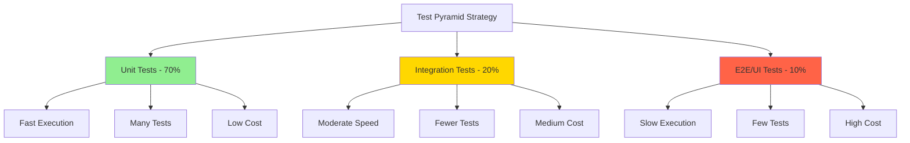

# Test Pyramid - Testing Strategy Visualization

The Test Pyramid is a framework for organizing automated tests by scope, speed, and cost. It helps teams balance test coverage with execution speed and maintenance overhead.

## The Test Pyramid (Visual Representation)

```
                    /\
                   /  \
                  / UI \           ← Few, slow, expensive
                 /Tests \
                /--------\
               /          \
              / Integration\       ← More, moderate speed
             /    Tests     \
            /--------------\
           /                \
          /   Unit Tests     \    ← Many, fast, cheap
         /____________________\
```

## Pyramid Layers (Bottom to Top)

### 1. Unit Tests (Base - 70%)
- **Purpose**: Test individual functions, methods, or classes in isolation
- **Scope**: Single component/module
- **Speed**: Very fast (milliseconds)
- **Cost**: Low maintenance
- **Quantity**: Most numerous (thousands)
- **Examples**:
  - Test a function that adds two numbers
  - Test a class method that validates email format
  - Test a utility function that formats dates

**Characteristics:**
- ✅ Fast execution
- ✅ Easy to write and maintain
- ✅ Precise failure localization
- ✅ No external dependencies (mocked)
- ❌ Don't test integration points

### 2. Integration Tests (Middle - 20%)
- **Purpose**: Test interactions between components, modules, or external systems
- **Scope**: Multiple components working together
- **Speed**: Moderate (seconds)
- **Cost**: Medium maintenance
- **Quantity**: Moderate (hundreds)
- **Examples**:
  - Test database read/write operations
  - Test API endpoints with real database
  - Test message queue publish/consume
  - Test file system operations

**Characteristics:**
- ✅ Test real interactions
- ✅ Catch integration bugs
- ✅ Verify component contracts
- ❌ Slower than unit tests
- ❌ Harder to debug failures
- ❌ Require infrastructure (databases, APIs)

### 3. UI/E2E Tests (Top - 10%)
- **Purpose**: Test complete user workflows from end to end
- **Scope**: Entire application stack
- **Speed**: Slow (minutes)
- **Cost**: High maintenance
- **Quantity**: Few (dozens)
- **Examples**:
  - Test user registration flow (UI → API → Database)
  - Test checkout process in e-commerce app
  - Test full business critical user journeys

**Characteristics:**
- ✅ Test real user scenarios
- ✅ High confidence in system behavior
- ✅ Catch issues across the stack
- ❌ Very slow execution
- ❌ Flaky and brittle
- ❌ Expensive to maintain
- ❌ Difficult to debug failures

## Mermaid Diagram



## Anti-Pattern: Ice Cream Cone

```
         \              /
          \            /           ← Many UI tests (slow, flaky)
           \  UI/E2E /
            \--------/
             \      /
              \ IT /               ← Some integration tests
               \  /
                \/                 ← Few unit tests (not enough coverage)
```

**Problems:**
- ❌ Slow test suite (hours instead of minutes)
- ❌ High maintenance cost
- ❌ Flaky tests cause CI/CD failures
- ❌ Difficult to debug failures
- ❌ Low confidence in test results

## Test Pyramid Best Practices

### 1. Maintain the Ratio
- **70% Unit Tests**: Fast feedback on code changes
- **20% Integration Tests**: Verify component interactions
- **10% E2E Tests**: Critical user journeys only

### 2. Test at the Right Level
- **Unit**: Business logic, algorithms, calculations
- **Integration**: Database access, API calls, message queues
- **E2E**: Critical user flows, happy paths

### 3. Optimize for Speed
- Run unit tests on every commit
- Run integration tests on pull requests
- Run E2E tests before deployment

### 4. Keep Tests Independent
- Tests should not depend on each other
- Each test should set up its own data
- Clean up after each test

### 5. Mock External Dependencies
- Unit tests should mock databases, APIs, file systems
- Integration tests can use real dependencies
- Use test doubles (mocks, stubs, fakes)

## Implementation Example

### Unit Test (Fast, Many)
```python
def test_calculate_discount():
    # Arrange
    price = 100
    discount_percent = 10

    # Act
    result = calculate_discount(price, discount_percent)

    # Assert
    assert result == 90
```

### Integration Test (Moderate, Some)
```python
def test_user_repository_save():
    # Arrange
    repo = UserRepository(database_connection)
    user = User(name="Alice", email="alice@example.com")

    # Act
    repo.save(user)

    # Assert
    saved_user = repo.get_by_email("alice@example.com")
    assert saved_user.name == "Alice"
```

### E2E Test (Slow, Few)
```python
def test_user_registration_flow():
    # Navigate to registration page
    browser.get("https://example.com/register")

    # Fill form
    browser.find_element_by_id("name").send_keys("Alice")
    browser.find_element_by_id("email").send_keys("alice@example.com")
    browser.find_element_by_id("password").send_keys("SecurePass123")

    # Submit
    browser.find_element_by_id("submit").click()

    # Assert success
    success_message = browser.find_element_by_class("success").text
    assert "Registration successful" in success_message
```

## Metrics to Track

### Coverage
- **Unit Test Coverage**: Aim for >80% line coverage
- **Integration Test Coverage**: Focus on critical paths
- **E2E Test Coverage**: Cover business-critical flows

### Speed
- **Unit Tests**: < 1 minute for entire suite
- **Integration Tests**: < 10 minutes for entire suite
- **E2E Tests**: < 30 minutes for entire suite

### Reliability
- **Flakiness Rate**: < 1% (tests that randomly fail)
- **Failure Analysis Time**: < 5 minutes to identify root cause
- **Fix Time**: < 30 minutes to fix failing tests

## Tools by Layer

### Unit Testing
- **JavaScript/TypeScript**: Jest, Mocha, Vitest
- **Python**: pytest, unittest
- **Go**: testing package
- **Java**: JUnit, TestNG

### Integration Testing
- **Databases**: Testcontainers, in-memory databases
- **APIs**: Supertest, RestAssured
- **Message Queues**: Testcontainers, embedded brokers

### E2E Testing
- **Web**: Playwright, Cypress, Selenium
- **Mobile**: Appium, Detox
- **API**: Postman, Newman

## Conclusion

The Test Pyramid is a guideline, not a hard rule. Adjust ratios based on:
- **Application Type**: APIs may have fewer UI tests
- **Team Size**: Smaller teams may focus on unit + integration
- **Risk Profile**: High-risk systems may need more E2E tests

**Key Takeaway**: Write more unit tests, some integration tests, and few E2E tests. Test at the lowest level possible for fast feedback and reliable CI/CD.
