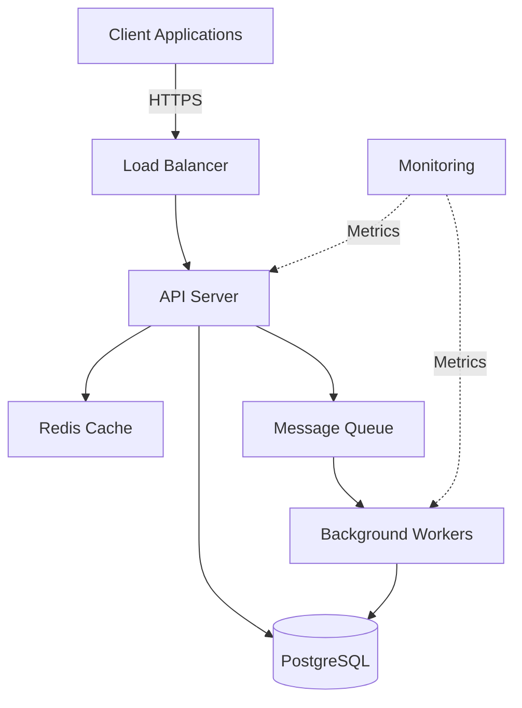

# Project Plan: [Project Name]

**Version:** 1.0.0
**Date:** [YYYY-MM-DD]
**Author:** [Your Name / Team]
**Status:** [Draft / In Progress / Active / Complete]

---

## 📋 Executive Summary

### Project Overview

**Name:** [Project Name]

**Purpose:** [1-2 sentences describing what this project does and why it exists]

**Target Users:** [Who will use this system?]

**Success Metrics:**
- [Metric 1: e.g., Handle 10K requests/second]
- [Metric 2: e.g., 99.9% uptime]
- [Metric 3: e.g., <200ms API response time]

### Technical Stack Decision

**Primary Language:** [e.g., Python 3.11]
**Rationale:** [Why this language? Performance, team expertise, ecosystem, etc.]

**Framework:** [e.g., FastAPI]
**Rationale:** [Why this framework? Speed, features, community support, etc.]

**Database:** [e.g., PostgreSQL 15]
**Rationale:** [Why this database? ACID compliance, features, scaling, etc.]

**Infrastructure:** [e.g., Docker + Kubernetes on AWS]
**Rationale:** [Why this infrastructure? Scalability, cost, team knowledge, etc.]

### Timeline Summary

- **Phase 1 (Foundation):** [Weeks 1-2] - Project setup, infrastructure, CI/CD
- **Phase 2 (Core Development):** [Weeks 3-5] - Core features, testing
- **Phase 3 (Security & Quality):** [Week 6] - Security hardening, testing
- **Phase 4 (Deployment):** [Week 7-8] - Production deployment, monitoring

**Target MVP Date:** [YYYY-MM-DD]

---

## 🏗️ Architecture

### System Architecture



### Component Responsibilities

#### API Server
- **Purpose:** Handle HTTP requests, business logic orchestration
- **Technology:** FastAPI (Python)
- **Scaling:** Horizontal (stateless)
- **Dependencies:** PostgreSQL, Redis, Message Queue

#### Database
- **Purpose:** Persistent data storage
- **Technology:** PostgreSQL 15
- **Scaling:** Vertical (primary), read replicas
- **Backup Strategy:** Daily automated backups, point-in-time recovery

#### Cache Layer
- **Purpose:** Reduce database load, improve response times
- **Technology:** Redis
- **Scaling:** Horizontal (cluster mode)
- **TTL Strategy:** [Define caching strategy]

#### Background Workers
- **Purpose:** Asynchronous task processing
- **Technology:** Celery (Python)
- **Scaling:** Horizontal (based on queue depth)
- **Tasks:** Email sending, data processing, report generation

### Data Flow

1. **Request Flow:**
   - Client → Load Balancer → API Server
   - API validates request (input validation, authentication)
   - API checks cache for cached responses
   - API queries database if needed
   - API returns response (JSON)

2. **Write Flow:**
   - Client → API → Validation → Database
   - API invalidates relevant cache entries
   - API publishes events to message queue (if needed)
   - Background workers process async tasks

3. **Read Flow:**
   - Client → API → Cache check
   - If cache hit: Return cached data
   - If cache miss: Query database → Cache result → Return data

### External Integrations

| Integration | Purpose | Protocol | Auth Method | SLA |
|------------|---------|----------|-------------|-----|
| [Service 1] | [Purpose] | REST/GraphQL | OAuth 2.0 | 99.9% |
| [Service 2] | [Purpose] | gRPC | API Key | 99.5% |

---

## 💻 Technology Stack

### Languages and Frameworks

| Component | Technology | Version | Justification |
|-----------|-----------|---------|---------------|
| Backend API | Python / FastAPI | 3.11 / 0.104+ | Performance, async support, type safety |
| Database ORM | SQLAlchemy | 2.0+ | Mature ORM, async support |
| Task Queue | Celery | 5.3+ | Robust async task processing |
| Testing | pytest | 7.4+ | Standard Python testing framework |
| Linting | Ruff | 0.1+ | Fast Python linter |
| Type Checking | mypy | 1.7+ | Static type analysis |

### Infrastructure

| Component | Technology | Justification |
|-----------|-----------|---------------|
| Container Runtime | Docker | Industry standard, reproducible builds |
| Orchestration | Kubernetes | Scaling, self-healing, declarative config |
| Cloud Provider | AWS | [Or GCP, Azure - explain choice] |
| CI/CD | GitHub Actions | Native GitHub integration, free for OSS |
| Monitoring | Prometheus + Grafana | Open source, powerful querying |
| Logging | ELK Stack | Centralized logging, powerful search |

### Development Tools

- **IDE:** VS Code with Python extension
- **Version Control:** Git + GitHub
- **API Documentation:** OpenAPI/Swagger (auto-generated by FastAPI)
- **Database Migrations:** Alembic
- **Package Management:** pip + requirements.txt (or Poetry)
- **Environment Management:** Docker Compose (local), Kubernetes (production)

---

## 📚 Standards Applied

### Loaded Standards

Based on project analysis, the following standards were loaded:

```bash
@load [product:api + CS:python + TS:pytest + SEC:* + DE:database + DOP:ci-cd]
```

### Standards Breakdown

| Standard Code | Standard Name | Key Patterns Applied |
|--------------|---------------|---------------------|
| CS:python | Python Coding Standards | PEP 8, type hints, docstrings, error handling |
| TS:pytest | pytest Testing Standards | Fixtures, parametrization, 80%+ coverage |
| SEC:auth | Authentication Standards | JWT tokens, OAuth 2.0, password hashing |
| SEC:secrets | Secrets Management | Environment variables, secret rotation |
| SEC:input-validation | Input Validation | Pydantic models, sanitization |
| DE:database | Database Standards | Migrations, connection pooling, transactions |
| DOP:ci-cd | CI/CD Standards | Automated testing, linting, security scans |
| NIST-IG:base | NIST Baseline Controls | AC-2, AU-2, IA-5, SC-8, SC-13 (auto-included) |

### Compliance Requirements

**[If applicable - remove this section if no compliance needed]**

- **Framework:** [e.g., HIPAA, PCI-DSS, SOC2, GDPR]
- **Controls Applied:** [List specific controls]
- **Evidence Collection:** [How compliance will be demonstrated]
- **Audit Frequency:** [e.g., Quarterly internal, Annual external]

---

## 📁 Project Structure

```
project-root/
├── src/
│   ├── main.py                 # Application entry point
│   ├── config.py               # Configuration management
│   ├── dependencies.py         # FastAPI dependencies
│   │
│   ├── api/                    # API layer
│   │   ├── __init__.py
│   │   ├── routes/             # Route handlers
│   │   │   ├── __init__.py
│   │   │   ├── auth.py         # Authentication endpoints
│   │   │   ├── users.py        # User management endpoints
│   │   │   └── items.py        # Business entity endpoints
│   │   ├── dependencies.py     # Route-level dependencies
│   │   └── middleware.py       # Custom middleware
│   │
│   ├── core/                   # Business logic
│   │   ├── __init__.py
│   │   ├── auth.py             # Authentication logic
│   │   ├── security.py         # Security utilities
│   │   └── exceptions.py       # Custom exceptions
│   │
│   ├── models/                 # Data models
│   │   ├── __init__.py
│   │   ├── database.py         # SQLAlchemy models
│   │   └── schemas.py          # Pydantic schemas (API contracts)
│   │
│   ├── services/               # Service layer
│   │   ├── __init__.py
│   │   ├── user_service.py     # User business logic
│   │   └── item_service.py     # Item business logic
│   │
│   ├── repositories/           # Data access layer
│   │   ├── __init__.py
│   │   ├── base.py             # Base repository
│   │   ├── user_repository.py  # User data access
│   │   └── item_repository.py  # Item data access
│   │
│   ├── tasks/                  # Background tasks (Celery)
│   │   ├── __init__.py
│   │   ├── celery_app.py       # Celery configuration
│   │   ├── email_tasks.py      # Email sending tasks
│   │   └── processing_tasks.py # Data processing tasks
│   │
│   └── utils/                  # Utility functions
│       ├── __init__.py
│       ├── logging.py          # Logging configuration
│       ├── validators.py       # Custom validators
│       └── helpers.py          # Helper functions
│
├── tests/
│   ├── __init__.py
│   ├── conftest.py             # pytest fixtures
│   │
│   ├── unit/                   # Unit tests
│   │   ├── __init__.py
│   │   ├── test_services.py    # Service layer tests
│   │   ├── test_repositories.py # Repository tests
│   │   └── test_utils.py       # Utility tests
│   │
│   ├── integration/            # Integration tests
│   │   ├── __init__.py
│   │   ├── test_api.py         # API integration tests
│   │   └── test_database.py    # Database integration tests
│   │
│   └── e2e/                    # End-to-end tests
│       ├── __init__.py
│       └── test_workflows.py   # Complete workflow tests
│
├── docs/
│   ├── api/                    # API documentation
│   │   ├── authentication.md   # Auth documentation
│   │   └── endpoints.md        # Endpoint reference
│   ├── guides/                 # User guides
│   │   ├── getting-started.md
│   │   └── deployment.md
│   └── architecture/           # Architecture docs
│       ├── decisions/          # ADRs (Architecture Decision Records)
│       └── diagrams/           # Architecture diagrams
│
├── config/
│   ├── development/            # Dev environment configs
│   │   └── .env.example
│   ├── staging/                # Staging configs
│   │   └── .env.example
│   └── production/             # Production configs
│       └── .env.example
│
├── scripts/
│   ├── setup/                  # Setup scripts
│   │   ├── install.sh          # Dependency installation
│   │   └── init-db.sh          # Database initialization
│   └── deploy/                 # Deployment scripts
│       ├── deploy.sh           # Deployment orchestration
│       └── rollback.sh         # Rollback script
│
├── migrations/                 # Alembic migrations
│   ├── versions/               # Migration versions
│   └── env.py                  # Migration environment
│
├── docker/
│   ├── Dockerfile              # Application container
│   ├── Dockerfile.worker       # Worker container
│   ├── docker-compose.yml      # Local development
│   └── docker-compose.prod.yml # Production compose
│
├── .github/
│   └── workflows/
│       ├── ci.yml              # Continuous Integration
│       ├── cd.yml              # Continuous Deployment
│       └── security.yml        # Security scanning
│
├── kubernetes/                 # K8s manifests (if applicable)
│   ├── deployment.yml
│   ├── service.yml
│   └── ingress.yml
│
├── .gitignore                  # Git ignore patterns
├── .env.example                # Environment template
├── requirements.txt            # Python dependencies
├── requirements-dev.txt        # Development dependencies
├── pyproject.toml              # Python project config
├── pytest.ini                  # pytest configuration
├── .pre-commit-config.yaml     # Pre-commit hooks
├── README.md                   # Project overview
├── LICENSE                     # License file
└── PROJECT_PLAN.md             # This file
```

### File Naming Conventions

- **Python files:** `lowercase_with_underscores.py`
- **Test files:** `test_*.py` (pytest convention)
- **Config files:** `lowercase-with-hyphens.yml`
- **Documentation:** `UPPERCASE_OR_Title_Case.md`

### Module Organization Principles

1. **Separation of Concerns:** Each layer has distinct responsibilities
2. **Dependency Direction:** Outer layers depend on inner layers (API → Services → Repositories)
3. **Testability:** Dependencies are injected, not hardcoded
4. **Single Responsibility:** Each module/class does one thing well

---

## 🔄 Development Workflow

### Git Branching Strategy

**Branch Types:**
- `main` - Production-ready code
- `develop` - Integration branch for features
- `feature/*` - Feature development branches
- `bugfix/*` - Bug fix branches
- `hotfix/*` - Emergency production fixes

**Workflow:**
1. Create feature branch from `develop`: `git checkout -b feature/user-authentication develop`
2. Develop feature with regular commits
3. Push branch and open Pull Request to `develop`
4. Code review and CI checks pass
5. Merge to `develop`
6. Periodic releases: Merge `develop` → `main` → Tag release

### Code Review Process

**Requirements for PR Approval:**
- [ ] All CI checks pass (tests, linting, security)
- [ ] Code coverage maintained or improved (minimum 80%)
- [ ] At least one approving review from team member
- [ ] No merge conflicts
- [ ] Documentation updated if needed
- [ ] CHANGELOG updated for user-facing changes

**Review Checklist:**
- [ ] Code follows coding standards (CS:python)
- [ ] Tests are comprehensive and meaningful
- [ ] Security best practices followed
- [ ] Error handling is robust
- [ ] Performance considerations addressed
- [ ] Documentation is clear and accurate

### Testing Approach

**Test Pyramid:**
- **Unit Tests (70%):** Fast, isolated, test individual functions/classes
- **Integration Tests (20%):** Test component interactions
- **E2E Tests (10%):** Test complete user workflows

**Coverage Requirements:**
- **Minimum:** 80% line coverage
- **Target:** 90%+ for critical paths (auth, payment, data processing)
- **Exclusions:** Migration scripts, configuration files

### Deployment Process

**Environments:**
1. **Development:** Developer machines (Docker Compose)
2. **Staging:** Kubernetes cluster (mimics production)
3. **Production:** Kubernetes cluster (HA configuration)

**Deployment Pipeline:**
1. Merge to `develop` → Auto-deploy to **Staging**
2. Smoke tests run on staging
3. Manual approval required
4. Merge to `main` → Auto-deploy to **Production**
5. Health checks and monitoring
6. Rollback if issues detected

---

## 🔐 Security Implementation

### Authentication Mechanism

**Strategy:** JWT (JSON Web Tokens) with refresh tokens

**Flow:**
1. User submits credentials (username + password)
2. Server validates credentials against database (hashed passwords with bcrypt)
3. Server issues access token (15-minute expiry) + refresh token (7-day expiry)
4. Client includes access token in `Authorization: Bearer <token>` header
5. Server validates token on each request
6. Client uses refresh token to obtain new access token when expired

**Implementation Details:**
- **Library:** `python-jose[cryptography]` for JWT handling
- **Password Hashing:** `passlib` with bcrypt algorithm
- **Token Storage:** Redis for refresh token allowlist/denylist
- **Security Headers:** Helmet-equivalent middleware for FastAPI

### Authorization Model

**Strategy:** Role-Based Access Control (RBAC)

**Roles:**
- `admin` - Full system access
- `user` - Standard user permissions
- `readonly` - Read-only access

**Permissions:**
- Defined per endpoint using FastAPI dependencies
- Checked via `Depends(require_role("admin"))` decorators
- Stored in database, cached in Redis

### Secret Management Approach

**Development:**
- `.env` files (NOT committed to git)
- `.env.example` template provided

**Production:**
- **AWS Secrets Manager** for sensitive credentials
- **Kubernetes Secrets** for deployment configs
- **Environment variables** injected at runtime
- **Secret rotation** automated (90-day cycle)

**Secrets Inventory:**
- Database connection strings
- API keys for external services
- JWT signing keys
- Encryption keys for PII

### Security Scanning Tools

**Pre-commit:**
- `gitleaks` - Secret detection in commits

**CI Pipeline:**
- `bandit` - Python security linter
- `safety` - Dependency vulnerability scanner
- `trivy` - Container image scanning
- `semgrep` - Static application security testing (SAST)

**Runtime:**
- `fail2ban` - Intrusion detection
- `ModSecurity` - Web application firewall (WAF)

### NIST Control Mapping

**[If compliance is required - otherwise remove this section]**

| NIST Control | Control Name | Implementation |
|-------------|--------------|----------------|
| AC-2 | Account Management | User CRUD with role assignments, audit logging |
| AU-2 | Audit Events | Centralized logging (ELK), immutable audit trail |
| IA-5 | Authenticator Management | Bcrypt password hashing, JWT tokens, MFA support |
| SC-8 | Transmission Confidentiality | TLS 1.3, HTTPS-only, HSTS headers |
| SC-13 | Cryptographic Protection | AES-256 for data at rest, TLS for transit |

---

## ✅ Testing Strategy

### Unit Test Approach

**Scope:** Individual functions, classes, and modules in isolation

**Tools:**
- `pytest` - Test framework
- `pytest-cov` - Coverage reporting
- `pytest-mock` - Mocking utilities
- `faker` - Test data generation

**Target Coverage:** 80%+ line coverage

**Example Unit Test:**

```python
# tests/unit/test_user_service.py
import pytest
from src.services.user_service import UserService
from src.models.schemas import UserCreate

@pytest.fixture
def user_service(mock_user_repository):
    return UserService(repository=mock_user_repository)

def test_create_user_success(user_service):
    """Test successful user creation."""
    user_data = UserCreate(
        email="test@example.com",
        password="SecurePass123!"
    )

    result = user_service.create_user(user_data)

    assert result.email == "test@example.com"
    assert result.id is not None
    assert not hasattr(result, 'password')  # Password not exposed

def test_create_user_duplicate_email(user_service):
    """Test user creation fails with duplicate email."""
    user_data = UserCreate(
        email="existing@example.com",
        password="SecurePass123!"
    )

    with pytest.raises(ValueError, match="Email already registered"):
        user_service.create_user(user_data)
```

### Integration Test Scenarios

**Scope:** Test interactions between components (API + Database, API + Cache, etc.)

**Setup:**
- Test database (PostgreSQL in Docker)
- Test Redis instance
- FastAPI TestClient

**Example Integration Test:**

```python
# tests/integration/test_api.py
from fastapi.testclient import TestClient
from src.main import app

client = TestClient(app)

def test_user_registration_flow():
    """Test complete user registration flow."""
    # 1. Register new user
    response = client.post("/api/v1/auth/register", json={
        "email": "newuser@example.com",
        "password": "SecurePass123!"
    })
    assert response.status_code == 201

    # 2. Login with new credentials
    response = client.post("/api/v1/auth/login", json={
        "email": "newuser@example.com",
        "password": "SecurePass123!"
    })
    assert response.status_code == 200
    token = response.json()["access_token"]

    # 3. Access protected endpoint
    response = client.get(
        "/api/v1/users/me",
        headers={"Authorization": f"Bearer {token}"}
    )
    assert response.status_code == 200
    assert response.json()["email"] == "newuser@example.com"
```

### End-to-End Test Cases

**Scope:** Complete user workflows from start to finish

**Tools:**
- `playwright` or `selenium` (for UI testing if applicable)
- API-based E2E tests for backend-only

**Example E2E Test:**

```python
# tests/e2e/test_workflows.py
def test_complete_item_management_workflow():
    """Test full CRUD workflow for items."""
    # 1. User registers and logs in
    token = register_and_login("user@example.com", "password")

    # 2. User creates an item
    item = create_item(token, {"name": "Test Item", "price": 99.99})
    assert item["id"] is not None

    # 3. User retrieves item
    retrieved = get_item(token, item["id"])
    assert retrieved["name"] == "Test Item"

    # 4. User updates item
    updated = update_item(token, item["id"], {"price": 89.99})
    assert updated["price"] == 89.99

    # 5. User deletes item
    delete_item(token, item["id"])

    # 6. Verify deletion
    with pytest.raises(NotFoundError):
        get_item(token, item["id"])
```

### Performance Testing

**Tools:**
- `locust` - Load testing
- `pytest-benchmark` - Benchmark tests

**Targets:**
- API response time: <200ms (p95)
- Throughput: 1000 requests/second
- Database query time: <50ms (p95)

**Example Load Test:**

```python
# tests/performance/locustfile.py
from locust import HttpUser, task, between

class APIUser(HttpUser):
    wait_time = between(1, 3)

    def on_start(self):
        """Login before running tasks."""
        response = self.client.post("/api/v1/auth/login", json={
            "email": "loadtest@example.com",
            "password": "password"
        })
        self.token = response.json()["access_token"]

    @task(3)
    def get_items(self):
        """Simulate getting items list."""
        self.client.get(
            "/api/v1/items",
            headers={"Authorization": f"Bearer {self.token}"}
        )

    @task(1)
    def create_item(self):
        """Simulate creating an item."""
        self.client.post(
            "/api/v1/items",
            headers={"Authorization": f"Bearer {self.token}"},
            json={"name": "Load Test Item", "price": 50.0}
        )
```

### Security Testing

**SAST (Static Analysis):**
- `bandit` - Python security issues
- `semgrep` - Custom security rules

**DAST (Dynamic Analysis):**
- `OWASP ZAP` - API security testing
- Penetration testing (manual, periodic)

**Dependency Scanning:**
- `safety` - Known vulnerabilities in dependencies
- `trivy` - Container vulnerabilities

---

## 🚦 Quality Gates

### Pre-commit Checks (Local)

Configured in `.pre-commit-config.yaml`:

```yaml
repos:
  - repo: https://github.com/pre-commit/pre-commit-hooks
    rev: v4.5.0
    hooks:
      - id: trailing-whitespace
      - id: end-of-file-fixer
      - id: check-yaml
      - id: check-added-large-files

  - repo: https://github.com/astral-sh/ruff-pre-commit
    rev: v0.1.6
    hooks:
      - id: ruff
        args: [--fix]

  - repo: https://github.com/psf/black
    rev: 23.11.0
    hooks:
      - id: black

  - repo: https://github.com/gitleaks/gitleaks
    rev: v8.18.1
    hooks:
      - id: gitleaks
```

### CI Pipeline Stages

**Stage 1: Lint & Format**
- Ruff linting (no errors allowed)
- Black formatting check (auto-fix in pre-commit)
- mypy type checking (no type errors)

**Stage 2: Security Scan**
- Gitleaks (no secrets in commits)
- Bandit (no high-severity issues)
- Safety (no critical vulnerabilities)

**Stage 3: Test**
- Unit tests (all pass)
- Integration tests (all pass)
- Coverage check (≥80%)

**Stage 4: Build**
- Docker image build
- Trivy container scan (no critical CVEs)

**Stage 5: Deploy (if all pass)**
- Deploy to staging (develop branch)
- Deploy to production (main branch, manual approval)

### Code Coverage Thresholds

```ini
# pytest.ini
[tool:pytest]
addopts = --cov=src --cov-report=html --cov-report=term --cov-fail-under=80
```

**Requirements:**
- **Overall:** ≥80% line coverage
- **Critical modules (auth, payment):** ≥90%
- **New code:** 100% coverage required

### Security Scan Requirements

**Bandit:**
- No high-severity issues
- Medium-severity issues must be justified and documented

**Safety:**
- No critical or high vulnerabilities in production dependencies
- Medium vulnerabilities must have mitigation plan

**Trivy:**
- No critical CVEs in base images
- High CVEs must be patched within 7 days

### Performance Benchmarks

**API Endpoints:**
- p50 (median): <100ms
- p95: <200ms
- p99: <500ms

**Database Queries:**
- Simple queries: <10ms
- Complex queries: <50ms
- Joins (≤3 tables): <100ms

**Load Testing:**
- Sustained throughput: 1000 req/sec
- Peak throughput: 2000 req/sec
- Error rate under load: <0.1%

---

## 📅 Implementation Timeline

### Phase 1: Foundation (Weeks 1-2)

**Week 1: Project Setup**
- [ ] Initialize Git repository
- [ ] Create project structure (directories, files)
- [ ] Configure development tools (Ruff, Black, mypy)
- [ ] Set up pre-commit hooks
- [ ] Create `.env.example` and configuration files
- [ ] Write initial README and documentation
- [ ] Set up Docker Compose for local development
- [ ] Configure CI pipeline (basic linting and testing)

**Week 2: Infrastructure**
- [ ] Design database schema
- [ ] Set up Alembic for migrations
- [ ] Create initial database migration
- [ ] Configure PostgreSQL (local and test databases)
- [ ] Set up Redis for caching and sessions
- [ ] Configure Celery for background tasks
- [ ] Set up basic monitoring (Prometheus + Grafana)
- [ ] Create health check endpoints

**Deliverables:**
- Working local development environment
- CI pipeline with linting and basic tests
- Database schema and migrations
- Documentation structure

### Phase 2: Core Development (Weeks 3-5)

**Week 3: Authentication & Authorization**
- [ ] Implement user model and repository
- [ ] Create registration endpoint with validation
- [ ] Implement password hashing (bcrypt)
- [ ] Build JWT token generation and validation
- [ ] Create login endpoint
- [ ] Implement refresh token mechanism
- [ ] Build RBAC system (roles and permissions)
- [ ] Write unit tests for auth logic (target: 90%+ coverage)

**Week 4: Core Business Logic**
- [ ] Implement core data models (e.g., Items, Orders, etc.)
- [ ] Create repository layer for data access
- [ ] Build service layer for business logic
- [ ] Implement CRUD endpoints for core entities
- [ ] Add input validation using Pydantic
- [ ] Implement error handling and custom exceptions
- [ ] Add caching for frequently accessed data
- [ ] Write unit tests for services and repositories

**Week 5: Integration & Polish**
- [ ] Implement background tasks (email, notifications, etc.)
- [ ] Add rate limiting on endpoints
- [ ] Implement pagination for list endpoints
- [ ] Add filtering and sorting capabilities
- [ ] Create OpenAPI documentation (auto-generated)
- [ ] Write integration tests for API endpoints
- [ ] Implement logging with structured logs
- [ ] Add request/response middleware (timing, tracing)

**Deliverables:**
- Fully functional API with core features
- Comprehensive test suite (≥80% coverage)
- Auto-generated API documentation
- Structured logging and monitoring

### Phase 3: Security & Quality (Week 6)

**Security Hardening**
- [ ] Implement input sanitization on all endpoints
- [ ] Add CORS configuration (restrictive defaults)
- [ ] Set up security headers (CSP, HSTS, etc.)
- [ ] Implement rate limiting and throttling
- [ ] Configure secret management (AWS Secrets Manager)
- [ ] Add SQL injection prevention (parameterized queries)
- [ ] Implement XSS prevention
- [ ] Run security scans (Bandit, Safety, OWASP ZAP)
- [ ] Address all high-severity security findings

**Quality Assurance**
- [ ] Achieve 80%+ test coverage
- [ ] Write E2E tests for critical workflows
- [ ] Run load testing (Locust)
- [ ] Optimize slow endpoints (profiling)
- [ ] Review and refactor code for maintainability
- [ ] Update documentation based on implementation
- [ ] Conduct internal code review
- [ ] Fix all linting and type checking issues

**Deliverables:**
- Security-hardened application
- Performance benchmarks met
- Complete test suite with high coverage
- Updated documentation

### Phase 4: Deployment (Weeks 7-8)

**Week 7: Staging Deployment**
- [ ] Create production-ready Docker images
- [ ] Write Kubernetes manifests (deployment, service, ingress)
- [ ] Set up staging environment (Kubernetes cluster)
- [ ] Configure environment-specific settings
- [ ] Deploy to staging
- [ ] Run smoke tests on staging
- [ ] Configure logging aggregation (ELK or CloudWatch)
- [ ] Set up monitoring dashboards (Grafana)
- [ ] Configure alerting (PagerDuty or similar)
- [ ] Conduct security scan on staging environment

**Week 8: Production Deployment**
- [ ] Production readiness review (checklist)
- [ ] Create runbook for operations
- [ ] Set up production Kubernetes cluster (HA config)
- [ ] Configure auto-scaling (HPA)
- [ ] Set up database backups and recovery
- [ ] Deploy to production (blue-green or canary)
- [ ] Run smoke tests on production
- [ ] Monitor metrics and logs post-deployment
- [ ] Create incident response plan
- [ ] Hand off to operations team
- [ ] Conduct retrospective and document lessons learned

**Deliverables:**
- Production deployment
- Monitoring and alerting configured
- Runbooks and documentation
- Incident response plan

---

## 🎯 Success Criteria

### Functional Requirements

- [ ] All planned features implemented and tested
- [ ] All API endpoints documented (OpenAPI)
- [ ] All user workflows function end-to-end
- [ ] Error handling is comprehensive and user-friendly
- [ ] Logging provides adequate debugging information

### Quality Metrics

- [ ] **Test Coverage:** ≥80% overall, ≥90% for critical paths
- [ ] **Code Quality:** Zero high-severity linting issues
- [ ] **Type Safety:** mypy passes with no errors
- [ ] **Documentation:** All public APIs documented
- [ ] **Code Review:** All code reviewed by at least one other developer

### Performance Targets

- [ ] **API Response Time:** p95 <200ms
- [ ] **Throughput:** 1000 requests/second sustained
- [ ] **Database Performance:** p95 query time <50ms
- [ ] **Uptime:** 99.9% availability (measured over 30 days)
- [ ] **Error Rate:** <0.1% under normal load

### Security Compliance

- [ ] **Authentication:** Secure JWT implementation with refresh tokens
- [ ] **Authorization:** RBAC enforced on all protected endpoints
- [ ] **Secrets Management:** No secrets in code or version control
- [ ] **Input Validation:** All inputs validated and sanitized
- [ ] **Security Scanning:** Zero high-severity vulnerabilities
- [ ] **Encryption:** TLS 1.3 for transit, AES-256 for data at rest
- [ ] **Audit Logging:** All security-relevant events logged

### Documentation Completeness

- [ ] **README:** Clear project overview and quick start guide
- [ ] **API Documentation:** OpenAPI spec with examples
- [ ] **Architecture Docs:** System diagrams and component descriptions
- [ ] **Deployment Guide:** Step-by-step deployment instructions
- [ ] **Runbook:** Operational procedures and troubleshooting
- [ ] **Security Docs:** Security architecture and practices
- [ ] **Contribution Guide:** How to contribute to the project

---

## 🔄 Change Management

### Handling Scope Changes

1. **Document the change request** in GitHub Issues
2. **Assess impact** on timeline, resources, and architecture
3. **Review with stakeholders** for approval/rejection
4. **Update this plan** if approved
5. **Communicate changes** to entire team

### Risk Management

| Risk | Likelihood | Impact | Mitigation |
|------|-----------|--------|------------|
| Dependency vulnerabilities | Medium | High | Regular scanning (Safety, Trivy), automated updates |
| Performance bottlenecks | Medium | Medium | Load testing, profiling, caching strategy |
| Database migration failures | Low | High | Test migrations on staging, backup before migration |
| Third-party API downtime | Medium | Medium | Circuit breakers, fallback mechanisms, monitoring |
| Team member unavailability | Medium | Medium | Knowledge sharing, documentation, pair programming |

### Communication Plan

**Daily:**
- Async updates in team chat (Slack/Discord)
- Blocker flagging and resolution

**Weekly:**
- Team sync meeting (30 minutes)
- Demo of completed features
- Planning for next week

**Bi-weekly (Sprint Boundaries):**
- Sprint retrospective (what went well, what to improve)
- Sprint planning (task breakdown and estimation)

---

## 📚 References

### Standards Applied

This project follows standards from the [Software Development Standards Repository](https://github.com/williamzujkowski/standards):

- **Coding Standards:** `docs/standards/CODING_STANDARDS.md`
- **Testing Standards:** `docs/standards/TESTING_STANDARDS.md`
- **Security Standards:** `docs/standards/MODERN_SECURITY_STANDARDS.md`
- **DevOps Standards:** `docs/standards/DEVOPS_STANDARDS.md`
- **NIST Implementation Guide:** `docs/nist/NIST_IMPLEMENTATION_GUIDE.md`

### External Resources

- **FastAPI Documentation:** https://fastapi.tiangolo.com/
- **SQLAlchemy Documentation:** https://docs.sqlalchemy.org/
- **pytest Documentation:** https://docs.pytest.org/
- **Docker Best Practices:** https://docs.docker.com/develop/dev-best-practices/
- **Kubernetes Documentation:** https://kubernetes.io/docs/
- **OWASP Top 10:** https://owasp.org/Top10/
- **NIST 800-53r5:** https://csrc.nist.gov/publications/detail/sp/800-53/rev-5/final

### Tools Documentation

- **Ruff:** https://docs.astral.sh/ruff/
- **Black:** https://black.readthedocs.io/
- **mypy:** https://mypy.readthedocs.io/
- **Bandit:** https://bandit.readthedocs.io/
- **Trivy:** https://aquasecurity.github.io/trivy/

---

## 📝 Appendix

### Glossary

- **API:** Application Programming Interface
- **CI/CD:** Continuous Integration / Continuous Deployment
- **CRUD:** Create, Read, Update, Delete
- **E2E:** End-to-End
- **HA:** High Availability
- **JWT:** JSON Web Token
- **RBAC:** Role-Based Access Control
- **REST:** Representational State Transfer
- **SLA:** Service Level Agreement
- **TDD:** Test-Driven Development

### Decision Log

| Date | Decision | Rationale | Alternatives Considered |
|------|----------|-----------|------------------------|
| [Date] | Use FastAPI | Performance, async support, auto-docs | Flask, Django |
| [Date] | PostgreSQL for database | ACID compliance, robust ecosystem | MongoDB, MySQL |
| [Date] | JWT for auth | Stateless, scalable, standard | Session-based, OAuth2 only |

### Contact Information

**Project Owner:** [Name] ([email@example.com](mailto:email@example.com))
**Tech Lead:** [Name] ([email@example.com](mailto:email@example.com))
**Team:** [Slack channel / email list]

---

**Plan Version History:**

| Version | Date | Author | Changes |
|---------|------|--------|---------|
| 1.0.0 | [YYYY-MM-DD] | [Name] | Initial plan creation |

---

**End of Project Plan**
